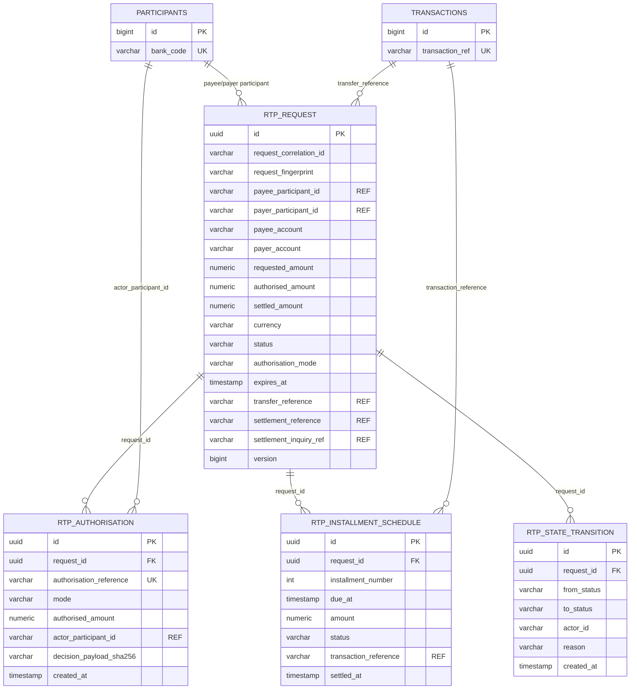
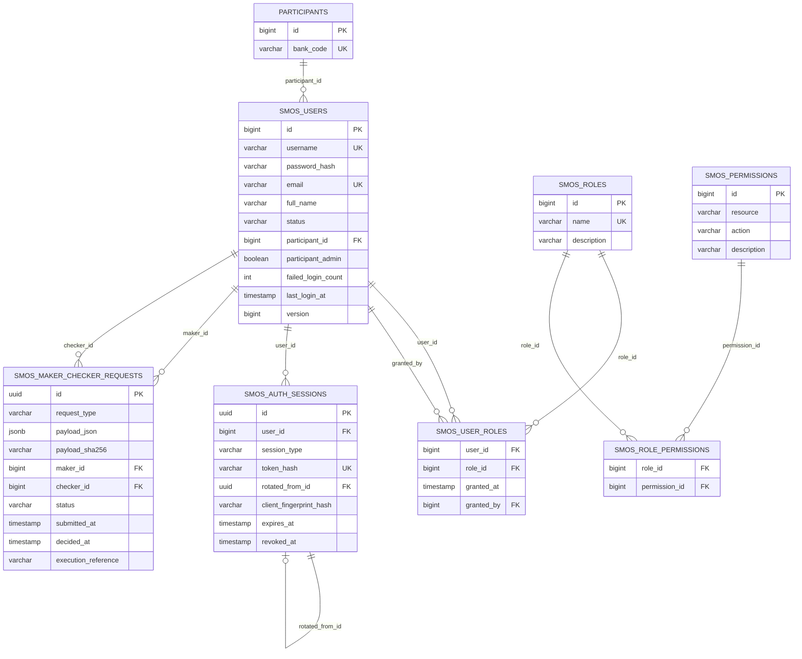
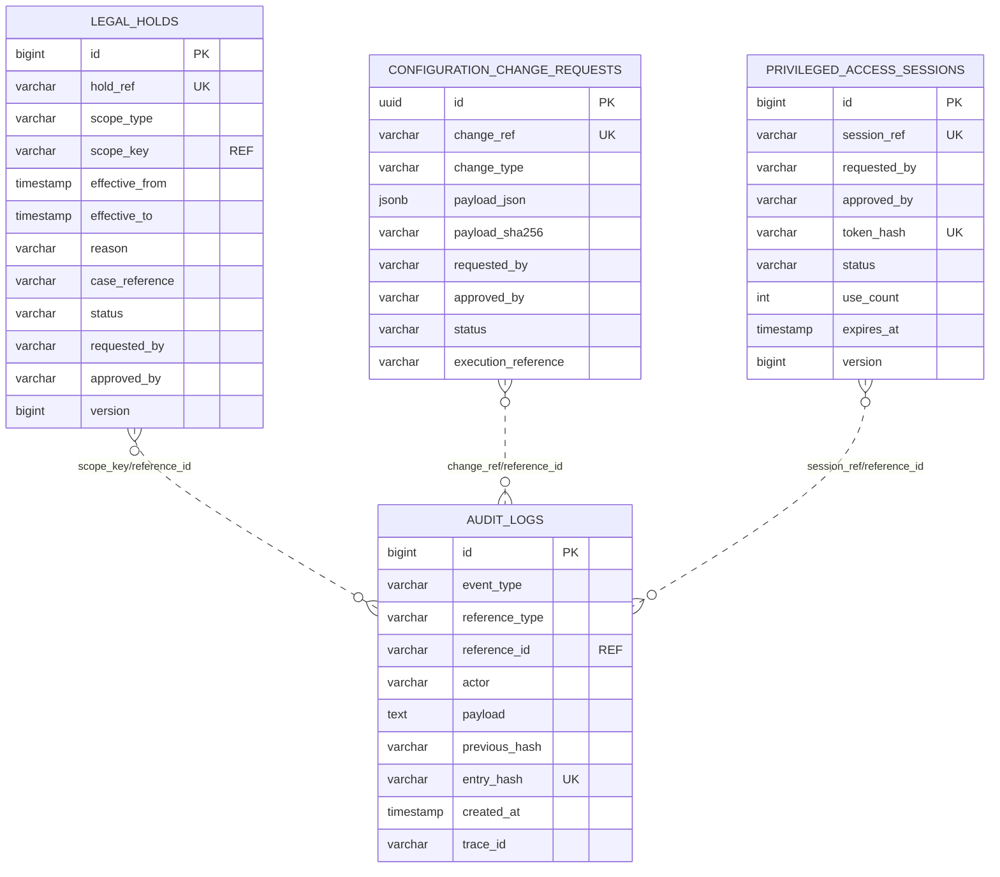

# Entity Relationship Structure

This file captures the project entity/table structure in Mermaid ER syntax.
It is based on the JPA entities under `src/main/java/com/example/switching/**/entity`
and Flyway migrations under `src/main/resources/db/migration`.

This single file includes both a readable domain ERD and a complete migration table catalog.

Legend:

- `PK` = primary key.
- `UK` = unique/natural key.
- `FK` = database foreign key.
- `REF` = application-level or natural-key reference without an explicit FK in the migration.
- Partitioned operational tables usually include a date column in the primary key.

## Core Switching ERD

```mermaid
erDiagram
    PARTICIPANTS {
        bigint id PK
        varchar bank_code UK
        varchar bank_name
        varchar status
        varchar participant_type
        varchar country
        varchar currency
        varchar settlement_account
        numeric max_daily_limit
        numeric max_single_txn
        timestamp created_at
        timestamp updated_at
    }

    PARTICIPANT_LIMITS {
        bigint id PK
        varchar bank_code FK
        varchar limit_type
        varchar currency
        numeric limit_value
        varchar period_type
        boolean is_active
        date effective_from
        date effective_to
    }

    ROUTING_RULES {
        bigint id PK
        varchar route_code UK
        varchar source_bank "REF"
        varchar destination_bank "REF"
        varchar message_type
        varchar connector_name "REF"
        int priority
        boolean enabled
    }

    CONNECTOR_CONFIGS {
        bigint id PK
        varchar connector_name UK
        varchar bank_code FK
        varchar connector_type
        varchar endpoint_url
        int timeout_ms
        boolean enabled
        boolean force_reject
    }

    CONNECTOR_CREDENTIALS {
        bigint id PK
        varchar connector_name FK
        varchar credential_type
        varchar credential_key
        text encrypted_value
        varchar key_ref
        timestamp expires_at
        boolean is_active
    }

    CONNECTOR_RATE_LIMITS {
        bigint id PK
        varchar connector_name FK
        varchar limit_type
        int limit_value
        int burst_value
        int window_seconds
        boolean is_active
    }

    PAYMENT_FLOWS {
        bigint id PK
        varchar flow_ref UK
        varchar inquiry_ref "REF"
        varchar transaction_ref "REF"
        varchar source_bank "REF"
        varchar destination_bank "REF"
        varchar channel_id
        numeric amount
        varchar currency
        varchar status
        date business_date PK
    }

    INQUIRIES {
        bigint id PK
        varchar inquiry_ref UK
        varchar client_inquiry_id
        varchar idempotency_key "REF"
        varchar flow_ref "REF"
        varchar message_id
        varchar instruction_id
        varchar end_to_end_id
        varchar source_bank "REF"
        varchar destination_bank "REF"
        varchar creditor_account
        numeric amount
        varchar currency
        varchar status
        boolean account_found
        boolean bank_available
        boolean eligible_for_transfer
        varchar used_by_transaction_ref "REF"
        date business_date PK
    }

    TRANSACTIONS {
        bigint id PK
        varchar transaction_ref UK
        varchar client_transaction_id
        varchar idempotency_key "REF"
        varchar flow_ref "REF"
        varchar inquiry_ref "REF"
        varchar source_bank "REF"
        varchar source_account_no
        varchar destination_bank "REF"
        varchar destination_account_no
        numeric amount
        varchar currency
        varchar channel_id
        varchar route_code "REF"
        varchar connector_name "REF"
        varchar status
        varchar settlement_status
        varchar confirmation_status
        date business_date PK
    }

    TRANSACTION_STATUS_HISTORY {
        bigint id PK
        varchar transaction_ref "REF"
        varchar from_status
        varchar to_status
        varchar reason_code
        varchar actor
        date business_date PK
        timestamp occurred_at
    }

    TRANSACTION_EVENTS {
        bigint id PK
        varchar transaction_ref "REF"
        varchar event_type
        jsonb payload
        varchar actor
        date business_date PK
        timestamp occurred_at
    }

    IDEMPOTENCY_RECORDS {
        bigint id PK
        varchar channel_id
        varchar idempotency_key
        varchar request_hash
        varchar transaction_ref "REF"
        varchar status
        timestamp expires_at
    }

    ISO_MESSAGES {
        bigint id PK
        varchar correlation_ref
        varchar transaction_ref "REF"
        varchar inquiry_ref "REF"
        varchar message_id
        varchar end_to_end_id
        varchar instruction_id
        varchar message_type
        varchar direction
        varchar source_bank "REF"
        varchar destination_bank "REF"
        varchar connector_name "REF"
        varchar security_status
        varchar validation_status
        date business_date PK
    }

    ISO_MESSAGE_PAYLOADS {
        bigint id PK
        bigint iso_message_id "REF"
        varchar payload_type
        text plain_payload
        text encrypted_payload
        int payload_size_bytes
        varchar payload_hash
        boolean stored_in_cold
        varchar cold_storage_key
        date business_date PK
    }

    ISO_VALIDATION_ERRORS {
        bigint id PK
        bigint iso_message_id "REF"
        varchar field_path
        varchar error_code
        text error_message
        varchar severity
        date business_date PK
    }

    SETTLEMENT_CYCLES {
        bigint id PK
        varchar cycle_ref UK
        date settlement_date
        smallint cycle_number
        varchar status
        timestamp opened_at
        timestamp closed_at
        timestamp settled_at
    }

    SETTLEMENT_POSITIONS {
        bigint id PK
        bigint cycle_id FK
        varchar bank_code FK
        varchar currency
        numeric debit_amount
        numeric credit_amount
        numeric net_position
        int transaction_count
        varchar status
    }

    SETTLEMENT_ITEMS {
        bigint id PK
        bigint cycle_id "REF"
        varchar bank_code "REF"
        varchar transaction_ref "REF"
        varchar direction
        numeric amount
        varchar currency
        date settlement_date PK
    }

    SETTLEMENT_INSTRUCTIONS {
        bigint instruction_id PK
        varchar instruction_ref UK
        bigint cycle_id FK
        varchar source_type
        varchar transfer_ref "REF"
        varchar debtor_psp_id FK
        varchar creditor_psp_id FK
        varchar currency
        numeric net_amount
        varchar status
        varchar rtgs_msg_id
    }

    SETTLEMENT_REPORTS {
        bigint id PK
        bigint cycle_id FK
        varchar report_ref UK
        varchar report_type
        varchar file_name
        varchar object_key
        varchar status
    }

    RECONCILIATION_FILES {
        bigint id PK
        varchar file_ref UK
        varchar source_bank "REF"
        varchar file_name
        varchar file_type
        date reconciliation_date
        varchar status
        int total_records
        int matched_count
        int unmatched_count
    }

    RECONCILIATION_ITEMS {
        bigint id PK
        bigint file_id "REF"
        int line_number
        varchar transaction_ref "REF"
        varchar external_ref
        numeric amount
        varchar currency
        varchar match_status
        text mismatch_reason
        date reconciliation_date PK
    }

    OUTBOX_EVENTS {
        bigint id PK
        varchar aggregate_type
        varchar aggregate_id
        varchar event_type
        jsonb payload
        varchar status
        int attempt_count
        timestamp next_attempt_at
        varchar failure_class
    }

    OUTBOX_DEAD_LETTER {
        uuid id PK
        bigint outbox_event_id "REF"
        varchar aggregate_type
        varchar aggregate_id
        varchar event_type
        jsonb payload
        varchar status
        varchar failure_class
        varchar payload_sha256
    }

    REVERSAL_LOG {
        bigint reversal_id PK
        varchar transaction_ref "REF"
        varchar psp_id "REF"
        varchar reason_code
        varchar status
        timestamp created_at
    }

    PSP_SUSPENSION_LOG {
        bigint suspension_id PK
        varchar psp_id "REF"
        timestamp suspended_at
        int reversal_count
        int window_minutes
        timestamp reinstated_at
    }

    WEBHOOK_REGISTRATIONS {
        bigint id PK
        varchar webhook_id UK
        varchar psp_id FK
        varchar url
        text event_types
        varchar secret_hash
        varchar status
        int failed_deliveries
    }

    WEBHOOK_DELIVERY_LOG {
        bigint id PK
        varchar webhook_id FK
        varchar event_type
        varchar event_ref "REF"
        text payload
        int attempt_count
        timestamp next_retry_at
        int response_status
        varchar status
    }

    VPA_REGISTRATIONS {
        varchar vpa_id PK
        varchar psp_id FK
        varchar account_no
        varchar alias_type
        varchar alias_value
        varchar status
        timestamp created_at
    }

    BENEFICIARY_TOKENS {
        bigint token_id PK
        varchar vpa_id FK
        varchar token
        varchar beneficiary_account
        timestamp expires_at
        boolean used
    }

    BILLERS {
        bigint biller_id PK
        varchar biller_code UK
        varchar biller_name
        varchar category
        varchar api_url
        varchar api_key_hash
        int timeout_seconds
        varchar status
    }

    BILL_TOKENS {
        bigint token_id PK
        bigint biller_id FK
        varchar bill_ref
        numeric bill_amount
        date due_date
        varchar customer_name
        text details
        timestamp expires_at
        boolean used
    }

    BILL_PAYMENTS {
        bigint payment_id PK
        bigint token_id FK
        bigint biller_id FK
        varchar transaction_ref "REF"
        numeric amount
        varchar status
        timestamp paid_at
    }

    FX_CORRIDORS {
        bigint corridor_id PK
        varchar source_currency
        varchar dest_currency
        varchar target_network
        numeric indicative_rate
        numeric min_amount
        numeric max_amount
        varchar status
    }

    FX_QUOTES {
        bigint quote_id PK
        bigint corridor_id FK
        varchar quote_ref UK
        numeric source_amount
        numeric dest_amount
        numeric rate
        timestamp expires_at
        varchar status
    }

    CROSSBORDER_TRANSFERS {
        bigint id PK
        bigint quote_id FK
        varchar transfer_ref "REF"
        varchar source_psp_id "REF"
        varchar destination_network
        numeric source_amount
        numeric destination_amount
        varchar status
    }

    DISPUTES {
        bigint dispute_id PK
        varchar txn_ref "REF"
        varchar raising_psp_id "REF"
        varchar responding_psp_id "REF"
        varchar dispute_type
        varchar status
        timestamp raised_at
        timestamp sla_deadline
        text evidence
    }

    DISPUTE_EVIDENCE_ATTACHMENTS {
        uuid id PK
        bigint dispute_id FK
        varchar file_name
        varchar object_key
        varchar sha256
        timestamp uploaded_at
    }

    AUDIT_LOGS {
        bigint id PK
        varchar event_type
        varchar reference_type
        varchar reference_id "REF"
        varchar actor
        text payload
        varchar previous_hash
        varchar entry_hash UK
        timestamp created_at
        varchar trace_id
    }

    API_KEYS {
        bigint id PK
        varchar key_value UK
        varchar key_prefix
        varchar name
        varchar role
        varchar bank_code "REF"
        boolean enabled
        timestamp expires_at
    }

    OAUTH_CLIENTS {
        varchar client_id PK
        varchar psp_id FK
        varchar client_secret_hash
        varchar tier
        text scopes
        varchar status
        timestamp expires_at
    }

    PARTICIPANT_CERTIFICATIONS {
        bigint id PK
        varchar certification_ref UK
        varchar bank_code FK
        varchar suite_version
        varchar git_commit
        varchar image_digest
        varchar evidence_sha256 UK
        varchar result
        timestamp executed_at
        timestamp expires_at
    }

    PARTICIPANTS ||--o{ PARTICIPANT_LIMITS : "bank_code"
    PARTICIPANTS ||--o{ CONNECTOR_CONFIGS : "bank_code"
    CONNECTOR_CONFIGS ||--o{ CONNECTOR_CREDENTIALS : "connector_name"
    CONNECTOR_CONFIGS ||--o{ CONNECTOR_RATE_LIMITS : "connector_name"
    CONNECTOR_CONFIGS ||--o{ ROUTING_RULES : "connector_name"

    PARTICIPANTS ||--o{ PAYMENT_FLOWS : "source_bank/destination_bank"
    PAYMENT_FLOWS ||--o| INQUIRIES : "flow_ref"
    PAYMENT_FLOWS ||--o| TRANSACTIONS : "flow_ref"
    INQUIRIES ||--o| TRANSACTIONS : "inquiry_ref"
    TRANSACTIONS ||--o{ TRANSACTION_STATUS_HISTORY : "transaction_ref"
    TRANSACTIONS ||--o{ TRANSACTION_EVENTS : "transaction_ref"
    TRANSACTIONS ||--o{ IDEMPOTENCY_RECORDS : "transaction_ref"

    TRANSACTIONS ||--o{ ISO_MESSAGES : "transaction_ref"
    INQUIRIES ||--o{ ISO_MESSAGES : "inquiry_ref"
    ISO_MESSAGES ||--o{ ISO_MESSAGE_PAYLOADS : "iso_message_id"
    ISO_MESSAGES ||--o{ ISO_VALIDATION_ERRORS : "iso_message_id"

    SETTLEMENT_CYCLES ||--o{ SETTLEMENT_POSITIONS : "cycle_id"
    PARTICIPANTS ||--o{ SETTLEMENT_POSITIONS : "bank_code"
    SETTLEMENT_CYCLES ||--o{ SETTLEMENT_ITEMS : "cycle_id"
    TRANSACTIONS ||--o{ SETTLEMENT_ITEMS : "transaction_ref"
    SETTLEMENT_CYCLES ||--o{ SETTLEMENT_INSTRUCTIONS : "cycle_id"
    PARTICIPANTS ||--o{ SETTLEMENT_INSTRUCTIONS : "debtor_psp_id"
    PARTICIPANTS ||--o{ SETTLEMENT_INSTRUCTIONS : "creditor_psp_id"
    SETTLEMENT_CYCLES ||--o{ SETTLEMENT_REPORTS : "cycle_id"

    RECONCILIATION_FILES ||--o{ RECONCILIATION_ITEMS : "file_id"
    TRANSACTIONS ||--o{ RECONCILIATION_ITEMS : "transaction_ref"

    OUTBOX_EVENTS ||--o{ OUTBOX_DEAD_LETTER : "outbox_event_id"
    TRANSACTIONS ||--o{ REVERSAL_LOG : "transaction_ref"
    PARTICIPANTS ||--o{ PSP_SUSPENSION_LOG : "psp_id"

    PARTICIPANTS ||--o{ WEBHOOK_REGISTRATIONS : "psp_id"
    WEBHOOK_REGISTRATIONS ||--o{ WEBHOOK_DELIVERY_LOG : "webhook_id"
    TRANSACTIONS ||--o{ WEBHOOK_DELIVERY_LOG : "event_ref"

    PARTICIPANTS ||--o{ VPA_REGISTRATIONS : "psp_id"
    VPA_REGISTRATIONS ||--o{ BENEFICIARY_TOKENS : "vpa_id"

    BILLERS ||--o{ BILL_TOKENS : "biller_id"
    BILLERS ||--o{ BILL_PAYMENTS : "biller_id"
    BILL_TOKENS ||--o{ BILL_PAYMENTS : "token_id"
    TRANSACTIONS ||--o{ BILL_PAYMENTS : "transaction_ref"

    FX_CORRIDORS ||--o{ FX_QUOTES : "corridor_id"
    FX_QUOTES ||--o{ CROSSBORDER_TRANSFERS : "quote_id"
    TRANSACTIONS ||--o{ CROSSBORDER_TRANSFERS : "transfer_ref"

    TRANSACTIONS ||--o{ DISPUTES : "txn_ref"
    PARTICIPANTS ||--o{ DISPUTES : "raising/responding_psp_id"
    DISPUTES ||--o{ DISPUTE_EVIDENCE_ATTACHMENTS : "dispute_id"

    PARTICIPANTS ||--o{ OAUTH_CLIENTS : "psp_id"
    PARTICIPANTS ||--o{ API_KEYS : "bank_code"
    PARTICIPANTS ||--o{ PARTICIPANT_CERTIFICATIONS : "bank_code"
```



## Request To Pay ERD



## SMOS User Management ERD



## Operational Governance ERD



## Notes

- The database intentionally uses many natural keys (`bank_code`, `transaction_ref`, `inquiry_ref`, `connector_name`, `webhook_id`) for operational correlation.
- Several partitioned tables do not declare cross-partition FKs, so the Mermaid diagram marks those links as `REF`.
- For exact DDL, use the Flyway migrations as source of truth. This document is a rendering-friendly map for architecture and onboarding.

## Full Database Table Catalog

Generated from `src/main/resources/db/migration/*.sql`. This is a complete migration table inventory for Mermaid rendering. Partition child tables created dynamically by PL/pgSQL loops are intentionally excluded; their parent partitioned tables are included.

Total migration tables: 201

### Tables 1-30

```mermaid
erDiagram
    FINANCIAL_PRECISION_POLICY {
        varchar_64 domain_name PK
        integer precision_digits
        integer scale_digits
        varchar_32 rounding_mode
        varchar_512 notes
        timestamptz updated_at
    }

    PROMOTION_BUDGET_ACCOUNT {
        bigint promotion_id PK
        varchar_8 currency
        numeric_24 budget_cap
        numeric_24 reserved_amount
        numeric_24 consumed_amount
        bigint version
        timestamptz updated_at
    }

    PROMOTION_BUDGET_RESERVATION {
        uuid reservation_id PK
        bigint promotion_id FK
        varchar_120 transaction_ref
        numeric_24 amount
        varchar_8 currency
        varchar_24 status
        timestamptz expires_at
        timestamptz consumed_at
        timestamptz released_at
        timestamptz refunded_at
        string more_columns "plus 1 more"
    }

    PROMOTION_FUNDER_LEDGER {
        uuid id PK
        bigint promotion_id FK
        varchar_120 transaction_ref
        uuid reservation_id FK
        varchar_24 entry_type
        numeric_24 amount
        varchar_8 currency
        varchar_160 idempotency_key
        uuid reversal_of FK
        timestamptz created_at
    }

    ARCHIVE_JOBS {
        bigint id PK
        varchar_80 job_ref
        varchar_30 job_type
        varchar_100 table_name
        date archive_from
        date archive_to
        varchar_20 status
        bigint rows_archived
        bigint rows_verified
        text error_message
        string more_columns "plus 4 more"
    }

    PARTITION_MAINTENANCE_LOGS {
        bigint id PK
        varchar_100 table_name
        varchar_120 partition_name
        varchar_20 operation
        date partition_date
        boolean success
        text error_message
        timestamp executed_at
    }

    SCHEDULER_LOCKS {
        varchar_64 lock_name
        timestamp lock_until
        timestamp locked_at
        varchar_255 locked_by
    }

    DRS_DISPUTE_ATTACHMENTS {
        bigint attachment_id PK
        bigint dispute_id FK
        varchar_255 file_name
        varchar_120 content_type
        bigint file_size_bytes
        varchar_64 sha256
        varchar_100 uploaded_by
        timestamp uploaded_at
        text description
        bytea payload
    }

    FEE_EXCEPTION {
        uuid id PK
        uuid tariff_rule_id FK
        varchar_32 participant_code
        varchar_80 message_type
        varchar_20 override_type
        numeric_24 override_value
        text reason
        varchar_120 requested_by
        timestamptz requested_at
        varchar_120 approved_by
        string more_columns "plus 4 more"
    }

    AUDIT_LOGS {
        bigint id PK
        varchar_60 event_type
        varchar_40 reference_type
        varchar_80 reference_id
        varchar_60 actor
        text payload
        date business_date
        timestamp created_at
    }

    WEBHOOK_REGISTRATIONS {
        bigint id PK
        varchar_36 webhook_id
        varchar_32 psp_id FK
        varchar_500 url
        text event_types
        varchar_256 secret_plain
        varchar_64 secret_hash
        varchar_20 status
        int failed_deliveries
        timestamp last_delivered_at
        string more_columns "plus 2 more"
    }

    WEBHOOK_DELIVERY_LOG {
        bigint id PK
        varchar_36 webhook_id FK
        varchar_100 event_type
        varchar_80 event_ref
        text payload
        int attempt_count
        timestamp last_attempt_at
        timestamp next_retry_at
        int response_status
        timestamp delivered_at
        string more_columns "plus 3 more"
    }

    SANCTIONS_LISTS {
        bigint list_id PK
        varchar_10 list_type
        varchar_500 entity_name
        varchar_10 entity_type
        jsonb identifiers
        timestamp added_at
        varchar_100 source_ref
        boolean is_active
    }

    SANCTIONS_SCREENING_RESULTS {
        bigint screen_id PK
        varchar_80 txn_id
        timestamp screened_at
        decimal_5 match_score
        text match_entity
        varchar_10 list_type
        varchar_15 outcome
        int screening_ms
        varchar_500 debtor_name
        varchar_500 creditor_name
        string more_columns "plus 1 more"
    }

    STR_REPORTS {
        bigint str_id PK
        varchar_80 txn_id
        timestamp triggered_at
        timestamp submitted_at
        varchar_100 submission_ref
        varchar_25 status
        jsonb report_payload
        int retry_count
        text last_error
        text matched_entity
        string more_columns "plus 1 more"
    }

    FRAUD_SCORES {
        bigint score_id PK
        varchar_80 txn_id
        timestamp scored_at
        decimal_5 score
        varchar_10 risk_tier
        jsonb signals
        varchar_10 action_taken
        varchar_32 sending_psp_id
        varchar_32 receiving_psp_id
        decimal_20 amount
    }

    VELOCITY_CHECKS {
        varchar_32 psp_id FK
        timestamp window_start
        timestamp window_end
        decimal_20 current_value
        decimal_20 limit_value
        boolean breached
        timestamp last_updated_at
    }

    PSP_POOLS {
        bigint pool_id PK
        varchar_32 psp_id FK
        decimal_20 balance
        decimal_20 held_amount
        decimal_20 available_balance
        char_3 currency
        decimal_20 minimum_balance
        decimal_5 alert_threshold_pct
        timestamp last_alert_sent_at
        timestamp last_updated_at
    }

    POOL_TRANSACTIONS {
        bigint pool_txn_id PK
        bigint pool_id FK
        varchar_80 txn_id
        varchar_15 operation
        decimal_20 amount
        decimal_20 balance_before
        decimal_20 held_before
        decimal_20 balance_after
        decimal_20 held_after
        timestamp occurred_at
        string more_columns "plus 2 more"
    }

    VPA_REGISTRATIONS {
        bigint id PK
        varchar_36 vpa_id
        varchar_20 vpa_type
        varchar_200 vpa_value
        varchar_32 psp_id FK
        varchar_200 account_ref
        varchar_20 account_type
        varchar_200 display_name
        boolean is_primary
        varchar_20 status
        string more_columns "plus 2 more"
    }

    PARTICIPANTS {
        bigint id PK
        varchar_32 bank_code
        varchar_255 bank_name
        varchar_32 status
        varchar_32 participant_type
        varchar_8 country
        varchar_8 currency
        varchar_20 swift_bic
        varchar_60 settlement_account
        numeric_18 max_daily_limit
        string more_columns "plus 5 more"
    }

    PARTICIPANT_LIMITS {
        bigint id PK
        varchar_32 bank_code FK
        varchar_40 limit_type
        varchar_8 currency
        numeric_18 limit_value
        varchar_20 period_type
        boolean is_active
        date effective_from
        date effective_to
        timestamp created_at
        string more_columns "plus 1 more"
    }

    ROUTING_RULES {
        bigint id PK
        varchar_128 route_code
        varchar_32 source_bank
        varchar_32 destination_bank
        varchar_32 message_type
        varchar_128 connector_name
        int priority
        boolean enabled
        timestamp created_at
        timestamp updated_at
    }

    CONNECTOR_CONFIGS {
        bigint id PK
        varchar_128 connector_name
        varchar_32 bank_code
        varchar_32 connector_type
        varchar_512 endpoint_url
        int timeout_ms
        boolean enabled
        boolean force_reject
        varchar_32 reject_reason_code
        varchar_512 reject_reason_message
        string more_columns "plus 2 more"
    }

    CONNECTOR_CREDENTIALS {
        bigint id PK
        varchar_128 connector_name FK
        varchar_40 credential_type
        varchar_100 credential_key
        text encrypted_value
        varchar_64 key_ref
        timestamp expires_at
        boolean is_active
        timestamp created_at
        timestamp updated_at
    }

    CONNECTOR_RATE_LIMITS {
        bigint id PK
        varchar_128 connector_name FK
        varchar_20 limit_type
        int limit_value
        int burst_value
        int window_seconds
        boolean is_active
        timestamp created_at
        timestamp updated_at
    }

    BENEFICIARY_TOKENS {
        varchar_36 token_id PK
        varchar_36 vpa_id FK
        timestamp issued_at
        timestamp expires_at
        boolean used
        timestamp used_at
    }

    SETTLEMENT_INSTRUCTIONS {
        bigint id PK
        varchar_80 instruction_ref
        bigint cycle_id FK
        varchar_32 debtor_psp_id FK
        varchar_32 creditor_psp_id FK
        varchar_8 currency
        numeric_18 net_amount
        varchar_24 status
        text approval_note
        varchar_100 approved_by
        string more_columns "plus 9 more"
    }

    SETTLEMENT_REPORTS {
        bigint id PK
        bigint cycle_id FK
        varchar_32 psp_id
        varchar_20 report_type
        varchar_80 report_ref
        text content
        timestamp generated_at
    }

    QR_CODES {
        bigint id PK
        varchar_36 qr_id
        varchar_100 merchant_id
        varchar_32 psp_id
        varchar_10 qr_type
        text payload_text
        decimal_20 amount
        varchar_3 currency
        varchar_100 txn_ref
        timestamp expires_at
        string more_columns "plus 2 more"
    }

    PROMOTION_BUDGET_ACCOUNT ||--o{ PROMOTION_BUDGET_RESERVATION : "promotion_id"
    PROMOTION_BUDGET_ACCOUNT ||--o{ PROMOTION_FUNDER_LEDGER : "promotion_id"
    PROMOTION_BUDGET_RESERVATION ||--o{ PROMOTION_FUNDER_LEDGER : "reservation_id"
    PROMOTION_FUNDER_LEDGER ||--o{ PROMOTION_FUNDER_LEDGER : "reversal_of"
    PARTICIPANTS ||--o{ WEBHOOK_REGISTRATIONS : "psp_id"
    WEBHOOK_REGISTRATIONS ||--o{ WEBHOOK_DELIVERY_LOG : "webhook_id"
    PARTICIPANTS ||--o{ VELOCITY_CHECKS : "psp_id"
    PARTICIPANTS ||--o{ PSP_POOLS : "psp_id"
    PSP_POOLS ||--o{ POOL_TRANSACTIONS : "pool_id"
    PARTICIPANTS ||--o{ VPA_REGISTRATIONS : "psp_id"
    PARTICIPANTS ||--o{ PARTICIPANT_LIMITS : "bank_code"
    CONNECTOR_CONFIGS ||--o{ CONNECTOR_CREDENTIALS : "connector_name"
    CONNECTOR_CONFIGS ||--o{ CONNECTOR_RATE_LIMITS : "connector_name"
    VPA_REGISTRATIONS ||--o{ BENEFICIARY_TOKENS : "vpa_id"
    PARTICIPANTS ||--o{ SETTLEMENT_INSTRUCTIONS : "debtor_psp_id"
    PARTICIPANTS ||--o{ SETTLEMENT_INSTRUCTIONS : "creditor_psp_id"
```



### Tables 31-60

```mermaid
erDiagram
    BILLERS {
        bigint biller_id PK
        varchar_50 biller_code
        varchar_200 biller_name
        varchar_20 category
        varchar_500 api_url
        varchar_64 api_key_hash
        int timeout_seconds
        varchar_10 status
        timestamp created_at
    }

    BILL_TOKENS {
        bigint token_id PK
        bigint biller_id FK
        varchar_200 bill_ref
        decimal_20 bill_amount
        date due_date
        varchar_200 customer_name
        text details
        timestamp fetched_at
        timestamp expires_at
        boolean used
    }

    BILL_PAYMENTS {
        bigint payment_id PK
        bigint token_id FK
        bigint biller_id FK
        varchar_200 bill_ref
        varchar_200 txn_ref
        varchar_32 paying_psp_id
        varchar_200 receipt_number
        decimal_20 amount
        varchar_10 status
        timestamp initiated_at
        string more_columns "plus 1 more"
    }

    DISPUTES {
        bigint dispute_id PK
        varchar_200 txn_ref
        varchar_32 raising_psp_id
        varchar_32 responding_psp_id
        varchar_30 dispute_type
        varchar_30 status
        timestamp raised_at
        timestamp sla_deadline
        timestamp resolved_at
        text evidence
        string more_columns "plus 4 more"
    }

    REFUND_TRANSACTIONS {
        bigint refund_id PK
        bigint dispute_id FK
        varchar_200 original_txn_ref
        varchar_200 refund_txn_ref
        decimal_20 amount
        varchar_10 status
        timestamp initiated_at
        timestamp completed_at
    }

    FX_CORRIDORS {
        bigint corridor_id PK
        varchar_3 source_currency
        varchar_3 dest_currency
        varchar_10 target_network
        decimal_20 indicative_rate
        decimal_20 min_amount
        decimal_20 max_amount
        decimal_7 fee_percent
        decimal_20 fee_fixed
        varchar_10 status
        string more_columns "plus 1 more"
    }

    API_KEYS {
        bigint id PK
        varchar_64 key_value
        varchar_16 key_prefix
        varchar_128 name
        varchar_32 role
        varchar_32 bank_code
        boolean enabled
        timestamp expires_at
        timestamp created_at
        timestamp last_used_at
    }

    OAUTH_CLIENTS {
        varchar_128 client_id
        varchar_32 psp_id
        varchar_64 client_secret_hash
        varchar_16 tier
        text scopes
        varchar_32 status
        timestamp expires_at
        timestamp created_at
    }

    PSP_CERTIFICATES {
        varchar_36 cert_id
        varchar_32 psp_id
        varchar_64 cert_fingerprint
        text subject_dn
        timestamp issued_at
        timestamp expires_at
        varchar_16 status
        timestamp created_at
    }

    FX_QUOTES {
        bigint quote_id PK
        bigint corridor_id FK
        varchar_3 source_currency
        varchar_3 dest_currency
        decimal_20 source_amount
        decimal_20 dest_amount
        decimal_20 rate
        decimal_20 fee
        timestamp issued_at
        timestamp expires_at
        string more_columns "plus 1 more"
    }

    CROSSBORDER_TRANSFERS {
        bigint cb_id PK
        bigint quote_id FK
        varchar_200 txn_ref
        varchar_32 initiating_psp_id
        varchar_50 purpose_code
        varchar_200 source_of_funds
        varchar_200 beneficiary_name
        varchar_200 beneficiary_bank
        varchar_200 beneficiary_account
        varchar_3 beneficiary_country
        string more_columns "plus 6 more"
    }

    SANCTIONS_IMPORT_RUNS {
        uuid run_id PK
        varchar_10 provider_code
        varchar_200 source_ref
        char_64 content_sha256
        varchar_16 status
        timestamptz fetched_at
        timestamptz started_at
        timestamptz completed_at
        integer parsed_count
        integer inserted_count
        string more_columns "plus 4 more"
    }

    SANCTIONS_IMPORT_STAGING {
        uuid batch_id
        varchar_10 provider_code
        varchar_220 provider_uid
        varchar_500 entity_name
        varchar_500 normalized_name
        varchar_10 entity_type
        jsonb aliases
        jsonb aliases_normalized
        jsonb identifiers
        varchar_200 source_ref
        string more_columns "plus 2 more"
    }

    OUTBOX_DEAD_LETTERS {
        bigserial id PK
        varchar_36 event_id
        varchar_160 schema_name
        integer schema_version
        bigint outbox_event_id
        varchar_128 transfer_ref
        text payload_json
        char_64 payload_sha256
        varchar_160 failure_type
        varchar_1000 failure_message
        string more_columns "plus 14 more"
    }

    DATABASE_MAINTENANCE_RUNS {
        bigserial id PK
        uuid run_id
        varchar_64 operation
        varchar_24 status
        timestamp started_at
        timestamp completed_at
        text details_json
    }

    LEGAL_HOLDS {
        bigserial id PK
        varchar_64 hold_ref
        varchar_24 scope_type
        varchar_160 scope_key
        date effective_from
        date effective_to
        varchar_1000 reason
        varchar_160 case_reference
        varchar_32 status
        varchar_160 requested_by
        string more_columns "plus 8 more"
    }

    RETENTION_EXECUTION_LOG {
        bigserial id PK
        varchar_160 policy_name
        varchar_160 target_table
        date business_date
        varchar_32 action
        varchar_24 status
        bigint affected_rows
        varchar_64 legal_hold_ref
        varchar_1000 details
        timestamp executed_at
    }

    PAYMENT_FLOWS {
        bigint id
        varchar_80 flow_ref
        varchar_80 inquiry_ref
        varchar_80 transaction_ref
        varchar_32 source_bank
        varchar_32 destination_bank
        varchar_50 channel_id
        numeric_18 amount
        varchar_8 currency
        varchar_30 status
        string more_columns "plus 6 more"
    }

    INQUIRIES {
        bigint id
        varchar_80 inquiry_ref
        varchar_128 client_inquiry_id
        varchar_255 idempotency_key
        varchar_80 flow_ref
        varchar_36 message_id
        varchar_36 instruction_id
        varchar_36 end_to_end_id
        varchar_32 source_bank
        varchar_32 destination_bank
        string more_columns "plus 20 more"
    }

    TRANSACTIONS {
        bigint id
        varchar_80 transaction_ref
        varchar_128 client_transaction_id
        varchar_255 idempotency_key
        varchar_80 flow_ref
        varchar_80 inquiry_ref
        varchar_32 source_bank
        varchar_34 source_account_no
        varchar_32 destination_bank
        varchar_34 destination_account_no
        string more_columns "plus 17 more"
    }

    TRANSACTION_STATUS_HISTORY {
        bigint id
        varchar_80 transaction_ref
        varchar_30 from_status
        varchar_30 to_status
        varchar_50 reason_code
        varchar_100 actor
        date business_date
        timestamp occurred_at
    }

    TRANSACTION_EVENTS {
        bigint id
        varchar_80 transaction_ref
        varchar_60 event_type
        jsonb payload
        varchar_100 actor
        date business_date
        timestamp occurred_at
    }

    IDEMPOTENCY_RECORDS {
        bigint id PK
        varchar_50 channel_id
        varchar_255 idempotency_key
        varchar_64 request_hash
        varchar_80 transaction_ref
        varchar_30 status
        timestamp expires_at
        timestamp created_at
        timestamp updated_at
    }

    INQUIRY_STATUS_HISTORY {
        bigint id PK
        varchar_80 inquiry_ref
        varchar_30 status
        varchar_50 reason_code
        timestamp created_at
    }

    PRIVILEGED_ACCESS_SESSIONS {
        bigserial id PK
        varchar_64 session_ref
        varchar_160 requested_by
        timestamp requested_at
        varchar_1000 reason
        varchar_160 ticket_reference
        integer requested_ttl_minutes
        integer max_uses
        varchar_160 approved_by
        timestamp approved_at
        string more_columns "plus 9 more"
    }

    CONFIGURATION_CHANGE_REQUESTS {
        bigserial id PK
        varchar_64 request_ref
        varchar_48 target_type
        varchar_160 target_key
        varchar_512 previous_value
        varchar_512 desired_value
        char_64 payload_sha256
        varchar_1000 reason
        varchar_160 ticket_reference
        varchar_24 status
        string more_columns "plus 11 more"
    }

    PARTICIPANT_CERTIFICATIONS {
        bigserial id PK
        varchar_64 certification_ref
        varchar_32 bank_code
        varchar_64 suite_version
        char_40 git_commit
        varchar_71 image_digest
        char_64 evidence_sha256
        varchar_16 result
        timestamp executed_at
        timestamp expires_at
        string more_columns "plus 3 more"
    }

    RECONCILIATION_CONTROL_RUN {
        uuid id PK
        date business_date
        varchar_80 source_system
        varchar_80 target_system
        varchar_40 run_type
        varchar_32 status
        bigint expected_count
        bigint actual_count
        numeric_20 expected_amount
        numeric_20 actual_amount
        string more_columns "plus 6 more"
    }

    RECONCILIATION_EXCEPTION_CASE {
        uuid id PK
        uuid run_id FK
        varchar_120 transaction_reference
        varchar_32 participant_code
        varchar_60 exception_type
        varchar_20 severity
        varchar_32 status
        char_64 expected_payload_hash
        char_64 actual_payload_hash
        varchar_120 assigned_to
        string more_columns "plus 4 more"
    }

    FRAUD_VELOCITY_RULE {
        uuid id PK
        varchar_80 rule_code
        text description
        varchar_40 subject_type
        integer window_seconds
        integer max_count
        numeric_20 max_amount
        varchar_3 currency
        varchar_24 action
        boolean enabled
        string more_columns "plus 3 more"
    }

    BILLERS ||--o{ BILL_TOKENS : "biller_id"
    BILL_TOKENS ||--o{ BILL_PAYMENTS : "token_id"
    BILLERS ||--o{ BILL_PAYMENTS : "biller_id"
    DISPUTES ||--o{ REFUND_TRANSACTIONS : "dispute_id"
    FX_CORRIDORS ||--o{ FX_QUOTES : "corridor_id"
    FX_QUOTES ||--o{ CROSSBORDER_TRANSFERS : "quote_id"
    RECONCILIATION_CONTROL_RUN ||--o{ RECONCILIATION_EXCEPTION_CASE : "run_id"
```



### Tables 61-90

```mermaid
erDiagram
    FRAUD_VELOCITY_DECISION {
        uuid id PK
        varchar_120 transaction_reference
        varchar_32 participant_code
        varchar_200 subject_key
        varchar_24 decision
        jsonb matched_rules
        integer risk_score
        char_64 evidence_hash
        timestamptz created_at
    }

    PARTICIPANT_LIFECYCLE_CASE {
        uuid id PK
        varchar_32 participant_code
        varchar_40 case_type
        varchar_32 status
        varchar_120 requested_by
        varchar_120 approved_by
        timestamptz requested_at
        timestamptz approved_at
        timestamptz effective_at
        timestamptz sla_due_at
        string more_columns "plus 3 more"
    }

    PARTICIPANT_CONTACT_REGISTRY {
        uuid id PK
        varchar_32 participant_code
        varchar_60 role
        varchar_160 contact_name
        varchar_254 email
        varchar_60 phone
        integer escalation_level
        boolean active
        timestamptz verified_at
    }

    ISO_VALIDATION_PACK {
        uuid id PK
        varchar_80 pack_code
        varchar_40 message_type
        varchar_40 version
        text schema_uri
        char_64 schema_sha256
        text rule_uri
        char_64 rule_sha256
        varchar_24 status
        timestamptz activated_at
        string more_columns "plus 2 more"
    }

    ISO_VALIDATION_RESULT {
        uuid id PK
        varchar_120 transaction_reference
        varchar_80 pack_code FK
        varchar_24 result
        jsonb errors
        char_64 canonical_payload_hash
        timestamptz created_at
    }

    SETTLEMENT_EVIDENCE_LEDGER {
        uuid id PK
        varchar_120 settlement_cycle_id
        varchar_60 evidence_type
        varchar_32 participant_code
        numeric_20 amount
        varchar_3 currency
        text source_uri
        char_64 source_sha256
        char_64 previous_hash
        char_64 chain_hash
        string more_columns "plus 2 more"
    }

    SETTLEMENT_DISPUTE_EVIDENCE {
        uuid id PK
        varchar_120 dispute_case_id
        uuid evidence_ledger_id FK
        varchar_120 submitted_by
        timestamptz submitted_at
        boolean accepted
        varchar_120 accepted_by
        timestamptz accepted_at
    }

    OPS_DAILY_CONTROL_ROOM {
        uuid id PK
        date business_date
        varchar_32 status
        jsonb opening_snapshot
        jsonb closing_snapshot
        varchar_120 opened_by
        varchar_120 closed_by
        timestamptz opened_at
        timestamptz closed_at
        char_64 close_evidence_sha256
    }

    OPS_CONTROL_ROOM_TASK {
        uuid id PK
        uuid control_room_id FK
        varchar_80 task_code
        varchar_200 title
        varchar_120 owner
        timestamptz due_at
        varchar_32 status
        timestamptz completed_at
        text evidence_uri
        char_64 evidence_sha256
    }

    DATA_QUALITY_RULE {
        uuid id PK
        varchar_100 rule_code
        varchar_120 table_name
        varchar_60 rule_type
        varchar_20 severity
        text sql_check
        boolean enabled
        varchar_120 owner
        timestamptz created_at
    }

    DATA_QUALITY_RUN {
        uuid id PK
        varchar_120 run_id
        varchar_100 rule_code FK
        varchar_24 status
        bigint failing_count
        jsonb sample_rows
        timestamptz started_at
        timestamptz completed_at
    }

    ISO_MESSAGES {
        bigint id
        varchar_100 correlation_ref
        varchar_80 transaction_ref
        varchar_80 inquiry_ref
        varchar_100 message_id
        varchar_100 end_to_end_id
        varchar_100 instruction_id
        varchar_50 message_type
        varchar_10 direction
        varchar_32 source_bank
        string more_columns "plus 9 more"
    }

    ISO_MESSAGE_PAYLOADS {
        bigint id
        bigint iso_message_id
        varchar_20 payload_type
        text plain_payload
        text encrypted_payload
        int payload_size_bytes
        varchar_64 payload_hash
        boolean stored_in_cold
        varchar_500 cold_storage_key
        date business_date
        string more_columns "plus 1 more"
    }

    ISO_VALIDATION_ERRORS {
        bigint id
        bigint iso_message_id
        varchar_200 field_path
        varchar_50 error_code
        text error_message
        varchar_10 severity
        date business_date
        timestamp created_at
    }

    REGION_READINESS_PROBE {
        uuid id PK
        varchar_40 region_code
        varchar_60 probe_type
        varchar_24 status
        integer latency_ms
        integer replication_lag_seconds
        jsonb evidence
        timestamptz observed_at
    }

    REGION_FAILOVER_CANDIDATE {
        uuid id PK
        varchar_40 region_code
        varchar_32 candidate_status
        timestamptz last_probe_at
        jsonb blocker_summary
        varchar_120 approved_by
        timestamptz approved_at
    }

    PRIVACY_ACCESS_CASE {
        uuid id PK
        varchar_120 case_reference
        varchar_40 requester_type
        varchar_200 subject_reference
        varchar_40 case_type
        varchar_32 status
        varchar_120 legal_basis
        timestamptz requested_at
        timestamptz due_at
        timestamptz completed_at
        string more_columns "plus 3 more"
    }

    PII_DISCOVERY_RESULT {
        uuid id PK
        varchar_120 scan_id
        varchar_120 table_name
        varchar_120 column_name
        varchar_80 pii_category
        integer confidence
        char_64 sample_hash
        timestamptz created_at
    }

    COMPLIANCE_CONTROL_DEFINITION {
        uuid id PK
        varchar_100 control_code
        varchar_80 domain
        varchar_200 title
        varchar_40 frequency
        text evidence_query
        varchar_120 owner
        boolean enabled
        timestamptz created_at
    }

    COMPLIANCE_CONTROL_RUN {
        uuid id PK
        varchar_120 run_id
        varchar_100 control_code FK
        varchar_24 result
        text evidence_uri
        char_64 evidence_sha256
        varchar_120 exception_reference
        timestamptz started_at
        timestamptz completed_at
    }

    CONTROL_LEDGER_ACCOUNT {
        varchar_80 account_code PK
        varchar_200 account_name
        varchar_32 participant_code
        char_3 currency
        varchar_6 normal_side
        boolean active
        timestamptz created_at
    }

    CONTROL_JOURNAL {
        uuid id PK
        varchar_80 source_type
        varchar_160 source_reference
        date business_date
        char_3 currency
        varchar_16 status
        char_64 evidence_hash
        varchar_120 created_by
        timestamptz created_at
        timestamptz posted_at
        string more_columns "plus 1 more"
    }

    CONTROL_JOURNAL_ENTRY {
        uuid id PK
        uuid journal_id FK
        integer line_no
        varchar_80 account_code FK
        varchar_6 side
        numeric_24 amount
        varchar_500 narrative
        timestamptz created_at
    }

    PARTICIPANT_LIQUIDITY_CONTROL {
        varchar_32 participant_code
        char_3 currency
        numeric_24 available_balance
        numeric_24 reserved_balance
        numeric_24 minimum_operating_balance
        numeric_24 warning_threshold
        bigint version
        timestamptz updated_at
    }

    LIQUIDITY_FUND_RESERVATION {
        uuid id PK
        varchar_160 reservation_reference
        varchar_32 participant_code
        char_3 currency
        numeric_24 amount
        varchar_16 status
        timestamptz expires_at
        timestamptz created_at
        timestamptz completed_at
    }

    LIQUIDITY_CONTROL_BREACH {
        uuid id PK
        varchar_32 participant_code
        char_3 currency
        varchar_40 breach_type
        numeric_24 headroom
        char_64 evidence_hash
        timestamptz detected_at
        timestamptz resolved_at
    }

    TARIFF_PLAN {
        uuid id PK
        varchar_80 plan_code
        varchar_500 description
        varchar_32 participant_code
        timestamptz created_at
    }

    TARIFF_VERSION {
        uuid id PK
        uuid plan_id FK
        integer version_no
        varchar_16 status
        timestamptz valid_from
        timestamptz valid_until
        varchar_120 requested_by
        varchar_120 approved_by
        varchar_500 approval_reason
        char_64 content_hash
        string more_columns "plus 1 more"
    }

    TARIFF_RULE {
        uuid id PK
        uuid tariff_version_id FK
        varchar_80 message_type
        char_3 currency
        numeric_24 minimum_amount
        numeric_24 maximum_amount
        numeric_24 flat_fee
        numeric_12 rate_basis_points
        numeric_24 minimum_fee
        numeric_24 maximum_fee
        string more_columns "plus 1 more"
    }

    FEE_ASSESSMENT {
        uuid id PK
        varchar_160 transaction_reference
        uuid tariff_version_id FK
        uuid tariff_rule_id FK
        numeric_24 amount
        numeric_24 assessed_fee
        char_3 currency
        char_64 evidence_hash
        timestamptz assessed_at
    }

    ISO_VALIDATION_PACK ||--o{ ISO_VALIDATION_RESULT : "pack_code"
    SETTLEMENT_EVIDENCE_LEDGER ||--o{ SETTLEMENT_DISPUTE_EVIDENCE : "evidence_ledger_id"
    OPS_DAILY_CONTROL_ROOM ||--o{ OPS_CONTROL_ROOM_TASK : "control_room_id"
    DATA_QUALITY_RULE ||--o{ DATA_QUALITY_RUN : "rule_code"
    COMPLIANCE_CONTROL_DEFINITION ||--o{ COMPLIANCE_CONTROL_RUN : "control_code"
    CONTROL_JOURNAL ||--o{ CONTROL_JOURNAL : "reversed_by_journal_id"
    CONTROL_JOURNAL ||--o{ CONTROL_JOURNAL_ENTRY : "journal_id"
    CONTROL_LEDGER_ACCOUNT ||--o{ CONTROL_JOURNAL_ENTRY : "account_code"
    PARTICIPANT_LIQUIDITY_CONTROL ||--o{ LIQUIDITY_FUND_RESERVATION : "participant_code,currency"
    TARIFF_PLAN ||--o{ TARIFF_VERSION : "plan_id"
    TARIFF_VERSION ||--o{ TARIFF_RULE : "tariff_version_id"
    TARIFF_VERSION ||--o{ FEE_ASSESSMENT : "tariff_version_id"
    TARIFF_RULE ||--o{ FEE_ASSESSMENT : "tariff_rule_id"
```



### Tables 91-120

```mermaid
erDiagram
    FX_GOVERNANCE_POLICY {
        varchar_7 currency_pair PK
        integer minimum_quorum
        integer maximum_age_seconds
        numeric_12 maximum_deviation_basis_points
        integer quote_ttl_seconds
        boolean enabled
        timestamptz updated_at
    }

    FX_RATE_PROVIDER {
        varchar_80 provider_code PK
        boolean enabled
        integer trust_weight
        timestamptz last_success_at
    }

    FX_RATE_OBSERVATION {
        uuid id PK
        varchar_80 provider_code FK
        varchar_7 currency_pair
        numeric_24 rate
        timestamptz observed_at
        char_64 payload_hash
        timestamptz received_at
    }

    GOVERNED_FX_RATE_PUBLICATION {
        uuid id PK
        varchar_7 currency_pair
        numeric_24 rate
        integer provider_count
        varchar_16 status
        timestamptz valid_from
        timestamptz valid_until
        varchar_120 requested_by
        varchar_120 approved_by
        char_64 evidence_hash
        string more_columns "plus 1 more"
    }

    PARTICIPANT_CERTIFICATE {
        uuid id PK
        varchar_32 participant_code
        varchar_24 certificate_type
        char_64 fingerprint_sha256
        varchar_160 serial_number
        varchar_1000 subject_dn
        varchar_1000 issuer_dn
        timestamptz not_before
        timestamptz not_after
        varchar_20 status
        string more_columns "plus 8 more"
    }

    CERTIFICATE_LIFECYCLE_EVENT {
        uuid id PK
        uuid certificate_id FK
        varchar_40 event_type
        varchar_120 actor
        varchar_500 reason
        char_64 evidence_hash
        timestamptz occurred_at
    }

    REGULATORY_REPORT_DEFINITION {
        varchar_80 report_code PK
        varchar_40 regulator_code
        varchar_20 frequency
        varchar_40 schema_version
        time due_time
        boolean enabled
        timestamptz updated_at
    }

    REGULATORY_REPORT_RUN {
        uuid id PK
        varchar_80 report_code FK
        date period_start
        date period_end
        varchar_20 status
        varchar_120 generated_by
        varchar_120 validated_by
        bigint record_count
        numeric_28 total_amount
        char_64 evidence_hash
        string more_columns "plus 2 more"
    }

    REGULATORY_REPORT_ARTIFACT {
        uuid id PK
        uuid report_run_id FK
        varchar_1000 object_key
        varchar_160 media_type
        bigint size_bytes
        char_64 sha256
        boolean encrypted
        timestamptz created_at
    }

    REGULATORY_REPORT_SUBMISSION {
        uuid id PK
        uuid report_run_id FK
        varchar_200 submission_reference
        varchar_120 submitted_by
        timestamptz submitted_at
        varchar_120 acknowledgement_code
        char_64 acknowledgement_hash
        timestamptz acknowledged_at
        varchar_20 response_status
    }

    NOTIFICATION_TEMPLATE {
        varchar_100 template_code PK
        varchar_200 purpose
        boolean contains_sensitive_data
        timestamptz created_at
    }

    NOTIFICATION_TEMPLATE_VERSION {
        uuid id PK
        varchar_100 template_code FK
        integer version_no
        varchar_20 channel
        varchar_20 locale
        text subject_template
        text body_template
        varchar_16 status
        varchar_120 requested_by
        varchar_120 approved_by
        string more_columns "plus 2 more"
    }

    NOTIFICATION_DELIVERY {
        uuid id PK
        varchar_200 deduplication_key
        uuid template_version_id FK
        char_64 recipient_reference_hash
        jsonb payload_json
        varchar_20 status
        integer attempt_count
        timestamptz next_attempt_at
        varchar_200 provider_reference
        varchar_100 last_error_code
        string more_columns "plus 3 more"
    }

    OUTBOX_MESSAGES {
        bigint id PK
        varchar_80 transaction_ref
        varchar_80 inquiry_ref
        varchar_100 message_type
        text payload
        varchar_20 status
        int retry_count
        int max_retries
        varchar_40 failure_class
        boolean will_retry
        string more_columns "plus 7 more"
    }

    OUTBOX_ATTEMPTS {
        bigint id PK
        bigint outbox_message_id
        int attempt_number
        varchar_20 status
        varchar_50 error_code
        varchar_500 error_message
        varchar_40 failure_class
        varchar_128 connector_name
        int duration_ms
        timestamp attempted_at
    }

    DEAD_LETTER_MESSAGES {
        bigint id PK
        bigint original_message_id
        varchar_80 transaction_ref
        varchar_100 message_type
        text payload
        varchar_500 failure_reason
        varchar_40 final_failure_class
        int total_attempts
        timestamp created_at
        timestamp reviewed_at
        string more_columns "plus 1 more"
    }

    RELEASE_CHANGE_WINDOW {
        uuid id PK
        varchar_160 window_name
        varchar_32 environment
        varchar_40 change_type
        timestamptz starts_at
        timestamptz ends_at
        varchar_120 approved_by
        timestamptz created_at
    }

    RELEASE_FREEZE_PERIOD {
        uuid id PK
        varchar_32 environment
        varchar_500 reason
        timestamptz starts_at
        timestamptz ends_at
        varchar_20 severity
        varchar_120 created_by
        varchar_120 approved_by
        timestamptz created_at
    }

    RELEASE_FREEZE_EXCEPTION {
        uuid id PK
        uuid freeze_period_id FK
        varchar_160 release_reference
        varchar_1000 justification
        varchar_120 requested_by
        varchar_120 approved_by
        timestamptz expires_at
        varchar_16 status
        timestamptz created_at
    }

    RELEASE_GATE_DECISION {
        uuid id PK
        varchar_160 release_reference
        varchar_32 environment
        varchar_40 change_type
        varchar_16 decision
        varchar_1000 reason
        varchar_120 evaluated_by
        char_64 evidence_hash
        timestamptz evaluated_at
    }

    SYNTHETIC_PROBE_DEFINITION {
        varchar_80 probe_code PK
        varchar_32 participant_code
        varchar_40 probe_type
        varchar_100 schedule_cron
        integer timeout_seconds
        numeric_20 maximum_amount
        char_3 currency
        boolean enabled
        timestamptz updated_at
    }

    SYNTHETIC_PROBE_EXECUTION {
        uuid id PK
        varchar_80 probe_code FK
        varchar_160 synthetic_reference
        timestamptz started_at
        timestamptz completed_at
        varchar_16 status
        bigint latency_ms
        varchar_80 response_code
        varchar_20 cleanup_status
        char_64 evidence_hash
        string more_columns "plus 1 more"
    }

    INCIDENT_RECORD {
        uuid id PK
        varchar_80 incident_reference
        varchar_8 severity
        varchar_300 title
        varchar_20 status
        varchar_120 incident_commander
        timestamptz detected_at
        timestamptz mitigated_at
        timestamptz closed_at
        text root_cause
        string more_columns "plus 3 more"
    }

    INCIDENT_TIMELINE_EVENT {
        uuid id PK
        uuid incident_id FK
        timestamptz event_time
        varchar_40 event_type
        text details
        varchar_120 actor
        char_64 evidence_hash
        timestamptz created_at
    }

    CORRECTIVE_ACTION {
        uuid id PK
        uuid incident_id FK
        varchar_20 action_type
        varchar_12 priority
        text description
        varchar_120 owner
        timestamptz due_at
        varchar_20 status
        timestamptz completed_at
        char_64 completion_evidence_hash
        string more_columns "plus 2 more"
    }

    INCIDENT_CLOSURE_APPROVAL {
        uuid id PK
        uuid incident_id FK
        varchar_40 approval_role
        varchar_120 approver
        varchar_16 decision
        varchar_1000 comment
        timestamptz decided_at
    }

    PARTICIPANT_PRODUCT_ENTITLEMENT {
        uuid id PK
        varchar_32 participant_code
        varchar_64 product_code
        varchar_32 channel
        char_3 currency
        varchar_16 status
        timestamptz effective_from
        timestamptz effective_until
        varchar_120 requested_by
        varchar_120 approved_by
        string more_columns "plus 2 more"
    }

    TRANSACTION_LIMIT_POLICY {
        uuid id PK
        varchar_160 policy_name
        varchar_24 scope_type
        varchar_160 scope_value
        varchar_64 product_code
        varchar_32 channel
        char_3 currency
        numeric_24 per_transaction_amount
        numeric_24 hourly_amount
        numeric_24 daily_amount
        string more_columns "plus 10 more"
    }

    TRANSACTION_LIMIT_CONSUMPTION {
        uuid policy_id FK
        varchar_32 participant_code
        varchar_64 product_code
        char_3 currency
        varchar_12 window_type
        timestamptz window_start
        timestamptz window_end
        numeric_24 consumed_amount
        bigint consumed_count
        timestamptz updated_at
    }

    TRANSACTION_LIMIT_OVERRIDE_REQUEST {
        uuid id PK
        uuid policy_id FK
        varchar_32 participant_code
        varchar_160 transaction_reference
        numeric_24 requested_amount
        varchar_1000 reason
        varchar_120 requested_by
        varchar_120 approved_by
        timestamptz expires_at
        varchar_16 status
        string more_columns "plus 3 more"
    }

    FX_RATE_PROVIDER ||--o{ FX_RATE_OBSERVATION : "provider_code"
    PARTICIPANT_CERTIFICATE ||--o{ PARTICIPANT_CERTIFICATE : "replaced_certificate_id"
    PARTICIPANT_CERTIFICATE ||--o{ CERTIFICATE_LIFECYCLE_EVENT : "certificate_id"
    REGULATORY_REPORT_DEFINITION ||--o{ REGULATORY_REPORT_RUN : "report_code"
    REGULATORY_REPORT_RUN ||--o{ REGULATORY_REPORT_ARTIFACT : "report_run_id"
    REGULATORY_REPORT_RUN ||--o{ REGULATORY_REPORT_SUBMISSION : "report_run_id"
    NOTIFICATION_TEMPLATE ||--o{ NOTIFICATION_TEMPLATE_VERSION : "template_code"
    NOTIFICATION_TEMPLATE_VERSION ||--o{ NOTIFICATION_DELIVERY : "template_version_id"
    RELEASE_FREEZE_PERIOD ||--o{ RELEASE_FREEZE_EXCEPTION : "freeze_period_id"
    SYNTHETIC_PROBE_DEFINITION ||--o{ SYNTHETIC_PROBE_EXECUTION : "probe_code"
    INCIDENT_RECORD ||--o{ INCIDENT_TIMELINE_EVENT : "incident_id"
    INCIDENT_RECORD ||--o{ CORRECTIVE_ACTION : "incident_id"
    INCIDENT_RECORD ||--o{ INCIDENT_CLOSURE_APPROVAL : "incident_id"
    TRANSACTION_LIMIT_POLICY ||--o{ TRANSACTION_LIMIT_CONSUMPTION : "policy_id"
    TRANSACTION_LIMIT_POLICY ||--o{ TRANSACTION_LIMIT_OVERRIDE_REQUEST : "policy_id"
```



### Tables 121-150

```mermaid
erDiagram
    TRANSACTION_LIMIT_DECISION_AUDIT {
        uuid id PK
        varchar_160 transaction_reference
        varchar_32 participant_code
        uuid policy_id FK
        varchar_16 decision
        numeric_24 amount
        varchar_1000 reason
        char_64 evidence_hash
        timestamptz decided_at
    }

    MANUAL_FINANCIAL_ADJUSTMENT {
        uuid id PK
        varchar_160 adjustment_reference
        date business_date
        char_3 currency
        varchar_64 reason_code
        varchar_2000 reason_detail
        varchar_20 status
        varchar_120 requested_by
        varchar_120 approved_by
        varchar_120 executed_by
        string more_columns "plus 6 more"
    }

    MANUAL_FINANCIAL_ADJUSTMENT_LINE {
        uuid id PK
        uuid adjustment_id FK
        integer line_no
        varchar_80 account_code FK
        varchar_6 side
        numeric_24 amount
        varchar_500 narrative
        timestamptz created_at
    }

    MANUAL_ADJUSTMENT_APPROVAL_EVENT {
        uuid id PK
        uuid adjustment_id FK
        varchar_120 actor
        varchar_16 decision
        varchar_1000 comment
        char_64 evidence_hash
        timestamptz created_at
    }

    SETTLEMENT_CALENDAR {
        uuid id PK
        varchar_64 calendar_code
        integer version
        varchar_80 timezone
        smallint weekend_days
        varchar_16 status
        date effective_from
        date effective_until
        varchar_120 requested_by
        varchar_120 approved_by
        string more_columns "plus 2 more"
    }

    SETTLEMENT_CALENDAR_HOLIDAY {
        uuid id PK
        uuid calendar_id FK
        date holiday_date
        varchar_200 holiday_name
        boolean full_day
        time early_close_time
        timestamptz created_at
    }

    SETTLEMENT_CUTOFF_RULE {
        uuid id PK
        uuid calendar_id FK
        varchar_64 cycle_code
        varchar_64 product_code
        time submission_cutoff
        time finality_cutoff
        varchar_20 late_action
        integer grace_seconds
        timestamptz created_at
    }

    SETTLEMENT_CALENDAR_CHANGE_REQUEST {
        uuid id PK
        varchar_64 calendar_code
        integer proposed_version
        char_64 bundle_hash
        varchar_1000 reason
        varchar_120 requested_by
        varchar_120 approved_by
        varchar_16 status
        timestamptz created_at
        timestamptz decided_at
    }

    SETTLEMENT_CUTOFF_DECISION {
        uuid id PK
        varchar_160 transaction_reference
        uuid calendar_id FK
        uuid cutoff_rule_id FK
        timestamptz submitted_at
        date business_date
        varchar_24 decision
        varchar_500 reason
        char_64 evidence_hash
        timestamptz created_at
    }

    PAYMENT_IDEMPOTENCY_RECORD {
        uuid id PK
        varchar_32 participant_code
        varchar_200 idempotency_key
        char_64 request_hash
        varchar_160 transaction_reference
        varchar_16 status
        char_64 response_hash
        timestamptz expires_at
        timestamptz created_at
        timestamptz completed_at
    }

    PAYMENT_DUPLICATE_FINGERPRINT {
        char_64 fingerprint PK
        varchar_32 participant_code
        varchar_64 product_code
        varchar_160 transaction_reference
        numeric_24 amount
        char_3 currency
        timestamptz first_seen_at
        timestamptz expires_at
    }

    PAYMENT_FINALITY_RECORD {
        uuid id PK
        varchar_160 transaction_reference
        varchar_32 participant_code
        varchar_20 finality_status
        varchar_500 finality_reason
        timestamptz finalized_at
        char_64 evidence_hash
        timestamptz created_at
    }

    PAYMENT_REVERSAL_REQUEST {
        uuid id PK
        varchar_160 transaction_reference FK
        varchar_160 reversal_reference
        varchar_64 reason_code
        varchar_1000 reason_detail
        varchar_120 requested_by
        varchar_120 operations_approved_by
        varchar_120 risk_approved_by
        varchar_20 status
        timestamptz expires_at
        string more_columns "plus 3 more"
    }

    CRYPTOGRAPHIC_ASSET_INVENTORY {
        uuid id PK
        varchar_120 asset_code
        varchar_32 asset_type
        varchar_64 provider
        varchar_500 external_reference
        char_64 fingerprint_sha256
        varchar_80 algorithm
        integer key_size_bits
        varchar_120 owner_team
        varchar_32 environment
        string more_columns "plus 8 more"
    }

    CRYPTOGRAPHIC_ASSET_BINDING {
        uuid id PK
        uuid asset_id FK
        varchar_120 service_name
        varchar_64 usage_type
        varchar_500 configuration_reference
        varchar_16 criticality
        timestamptz created_at
    }

    CRYPTOGRAPHIC_ROTATION_PLAN {
        uuid id PK
        uuid asset_id FK
        timestamptz planned_for
        timestamptz overlap_until
        varchar_500 rollback_reference
        varchar_120 requested_by
        varchar_120 approved_by
        varchar_120 executed_by
        varchar_20 status
        char_64 old_fingerprint
        string more_columns "plus 4 more"
    }

    CRYPTOGRAPHIC_ROTATION_EVIDENCE {
        uuid id PK
        uuid rotation_plan_id FK
        varchar_64 evidence_type
        varchar_1000 artifact_reference
        char_64 artifact_sha256
        varchar_120 recorded_by
        timestamptz recorded_at
    }

    THIRD_PARTY_DEPENDENCY {
        uuid id PK
        varchar_80 dependency_code
        varchar_200 display_name
        varchar_32 dependency_type
        varchar_500 endpoint_reference
        varchar_120 owner_team
        varchar_16 criticality
        boolean enabled
        timestamptz created_at
    }

    THIRD_PARTY_SLA_POLICY {
        uuid id PK
        uuid dependency_id FK
        integer version
        numeric_7 availability_target
        integer latency_p95_ms
        integer failure_threshold
        integer recovery_success_threshold
        integer open_seconds
        varchar_16 status
        varchar_120 requested_by
        string more_columns "plus 3 more"
    }

    THIRD_PARTY_HEALTH_SAMPLE {
        uuid id PK
        uuid dependency_id FK
        timestamptz observed_at
        boolean success
        integer latency_ms
        varchar_32 response_class
        char_64 evidence_hash
    }

    THIRD_PARTY_CIRCUIT_STATE {
        uuid dependency_id PK FK
        varchar_16 state
        integer consecutive_failures
        integer consecutive_successes
        timestamptz opened_at
        timestamptz next_probe_at
        varchar_500 reason
        timestamptz updated_at
    }

    THIRD_PARTY_OVERRIDE_REQUEST {
        uuid id PK
        uuid dependency_id FK
        varchar_16 requested_state
        varchar_1000 reason
        varchar_120 requested_by
        varchar_120 approved_by
        timestamptz expires_at
        varchar_16 status
        timestamptz created_at
    }

    CAPACITY_OBSERVATION {
        uuid id PK
        varchar_80 component
        varchar_32 environment
        timestamptz observed_at
        numeric_24 request_rate
        numeric_7 cpu_utilization
        numeric_7 memory_utilization
        numeric_16 p95_latency_ms
        numeric_7 error_rate
        integer active_replicas
        string more_columns "plus 1 more"
    }

    CAPACITY_FORECAST {
        uuid id PK
        varchar_80 component
        varchar_32 environment
        integer horizon_days
        timestamptz forecast_for
        numeric_24 forecast_request_rate
        integer required_replicas
        numeric_24 confidence_lower
        numeric_24 confidence_upper
        varchar_80 model_version
        string more_columns "plus 4 more"
    }

    GOVERNED_AUTOSCALING_POLICY {
        uuid id PK
        varchar_80 component
        varchar_32 environment
        integer version
        integer min_replicas
        integer max_replicas
        integer target_cpu_percent
        integer target_memory_percent
        integer scale_up_percent
        integer scale_down_percent
        string more_columns "plus 6 more"
    }

    CAPACITY_CHANGE_REQUEST {
        uuid id PK
        uuid policy_id FK
        uuid forecast_id FK
        varchar_1000 reason
        varchar_120 requested_by
        varchar_120 operations_approved_by
        varchar_120 performance_approved_by
        varchar_20 status
        varchar_500 rollback_reference
        char_64 evidence_hash
        string more_columns "plus 1 more"
    }

    REVERSAL_LOG {
        bigint reversal_id PK
        varchar_80 original_txn_id
        varchar_80 reversal_txn_id
        varchar_32 destination_bank
        varchar_30 reason
        varchar_20 status
        varchar_40 failure_class
        timestamp triggered_at
        timestamp completed_at
        timestamp created_at
        string more_columns "plus 1 more"
    }

    PSP_SUSPENSION_LOG {
        bigint suspension_id PK
        varchar_32 psp_id FK
        timestamp suspended_at
        int reversal_count
        int window_minutes
        timestamp reinstated_at
        varchar_100 reinstated_by
        timestamp created_at
    }

    GOVERNED_DATA_ASSET {
        uuid id PK
        varchar_160 asset_code
        varchar_24 asset_type
        varchar_1000 physical_reference
        varchar_120 owner_team
        varchar_24 classification
        varchar_80 retention_policy_code
        boolean contains_pii
        varchar_16 status
        char_64 evidence_hash
        string more_columns "plus 1 more"
    }

    DATA_LINEAGE_EDGE {
        uuid id PK
        uuid source_asset_id FK
        uuid target_asset_id FK
        varchar_160 transformation_code
        varchar_80 transformation_version
        varchar_500 processing_purpose
        char_64 field_mapping_hash
        varchar_16 status
        varchar_120 approved_by
        timestamptz created_at
    }

    MANUAL_FINANCIAL_ADJUSTMENT ||--o{ MANUAL_FINANCIAL_ADJUSTMENT_LINE : "adjustment_id"
    MANUAL_FINANCIAL_ADJUSTMENT ||--o{ MANUAL_ADJUSTMENT_APPROVAL_EVENT : "adjustment_id"
    SETTLEMENT_CALENDAR ||--o{ SETTLEMENT_CALENDAR_HOLIDAY : "calendar_id"
    SETTLEMENT_CALENDAR ||--o{ SETTLEMENT_CUTOFF_RULE : "calendar_id"
    SETTLEMENT_CALENDAR ||--o{ SETTLEMENT_CUTOFF_DECISION : "calendar_id"
    SETTLEMENT_CUTOFF_RULE ||--o{ SETTLEMENT_CUTOFF_DECISION : "cutoff_rule_id"
    PAYMENT_FINALITY_RECORD ||--o{ PAYMENT_REVERSAL_REQUEST : "transaction_reference"
    CRYPTOGRAPHIC_ASSET_INVENTORY ||--o{ CRYPTOGRAPHIC_ASSET_BINDING : "asset_id"
    CRYPTOGRAPHIC_ASSET_INVENTORY ||--o{ CRYPTOGRAPHIC_ROTATION_PLAN : "asset_id"
    CRYPTOGRAPHIC_ROTATION_PLAN ||--o{ CRYPTOGRAPHIC_ROTATION_EVIDENCE : "rotation_plan_id"
    THIRD_PARTY_DEPENDENCY ||--o{ THIRD_PARTY_SLA_POLICY : "dependency_id"
    THIRD_PARTY_DEPENDENCY ||--o{ THIRD_PARTY_HEALTH_SAMPLE : "dependency_id"
    THIRD_PARTY_DEPENDENCY ||--o{ THIRD_PARTY_CIRCUIT_STATE : "dependency_id"
    THIRD_PARTY_DEPENDENCY ||--o{ THIRD_PARTY_OVERRIDE_REQUEST : "dependency_id"
    GOVERNED_AUTOSCALING_POLICY ||--o{ CAPACITY_CHANGE_REQUEST : "policy_id"
    CAPACITY_FORECAST ||--o{ CAPACITY_CHANGE_REQUEST : "forecast_id"
    GOVERNED_DATA_ASSET ||--o{ DATA_LINEAGE_EDGE : "source_asset_id"
    GOVERNED_DATA_ASSET ||--o{ DATA_LINEAGE_EDGE : "target_asset_id"
```

### Tables 151-180

```mermaid
erDiagram
    CONTROL_EVIDENCE_CATALOG {
        uuid id PK
        varchar_80 control_code
        timestamptz evidence_period_start
        timestamptz evidence_period_end
        varchar_1500 artifact_reference
        char_64 artifact_sha256
        varchar_120 content_type
        bigint size_bytes
        varchar_120 producer
        varchar_16 status
        string more_columns "plus 2 more"
    }

    CONTROL_EVIDENCE_VERIFICATION {
        uuid id PK
        uuid evidence_id FK
        varchar_120 verifier
        varchar_16 decision
        char_64 observed_sha256
        varchar_1000 comment
        timestamptz verified_at
    }

    DECISION_RULE_PACKAGE {
        uuid id PK
        varchar_120 package_code
        varchar_24 domain
        varchar_120 owner_team
        varchar_16 criticality
        varchar_16 status
        timestamptz created_at
    }

    DECISION_RULE_VERSION {
        uuid id PK
        uuid package_id FK
        varchar_80 version
        varchar_1000 artifact_reference
        char_64 artifact_sha256
        char_64 manifest_sha256
        varchar_1000 change_reason
        varchar_120 requested_by
        varchar_120 risk_approved_by
        varchar_120 compliance_approved_by
        string more_columns "plus 5 more"
    }

    DECISION_RULE_TEST_EXECUTION {
        uuid id PK
        uuid rule_version_id FK
        varchar_80 suite_version
        integer test_case_count
        integer passed_count
        integer failed_count
        numeric_7 false_positive_rate
        numeric_7 false_negative_rate
        varchar_12 status
        varchar_1000 result_artifact_reference
        string more_columns "plus 3 more"
    }

    DECISION_RULE_DEPLOYMENT {
        uuid id PK
        uuid rule_version_id FK
        varchar_32 environment
        varchar_160 deployment_reference
        uuid previous_version_id FK
        varchar_120 deployed_by
        varchar_20 status
        timestamptz started_at
        timestamptz completed_at
        char_64 evidence_hash
    }

    DECOMMISSION_PLAN {
        uuid id PK
        varchar_160 plan_reference
        varchar_24 target_type
        varchar_160 target_code
        timestamptz planned_effective_at
        varchar_2000 reason
        boolean data_exit_required
        varchar_24 status
        varchar_120 requested_by
        varchar_120 operations_approved_by
        string more_columns "plus 6 more"
    }

    DECOMMISSION_TASK {
        uuid id PK
        uuid plan_id FK
        varchar_80 task_code
        integer task_order
        varchar_120 owner_team
        varchar_1000 description
        boolean blocking
        varchar_16 status
        char_64 completion_evidence_hash
        varchar_120 completed_by
        string more_columns "plus 1 more"
    }

    DECOMMISSION_DATA_EXIT_ARTIFACT {
        uuid id PK
        uuid plan_id FK
        varchar_64 artifact_type
        varchar_1500 artifact_reference
        char_64 artifact_sha256
        boolean encrypted
        varchar_500 recipient_reference
        bigint size_bytes
        date retention_until
        varchar_120 created_by
        string more_columns "plus 1 more"
    }

    DECOMMISSION_EXECUTION_EVENT {
        uuid id PK
        uuid plan_id FK
        varchar_64 event_type
        varchar_120 actor
        varchar_2000 detail
        char_64 evidence_hash
        timestamptz created_at
    }

    REPORTING_TRANSACTION_STATUS_DAILY {
        date summary_date
        varchar_30 status
        bigint total_count
        timestamp calculated_at
        timestamp source_through_at
        bigint source_row_count
        varchar_30 aggregation_version
    }

    REPORTING_INQUIRY_STATUS_DAILY {
        date summary_date
        varchar_30 status
        bigint total_count
        timestamp calculated_at
        timestamp source_through_at
        bigint source_row_count
        varchar_30 aggregation_version
    }

    REPORTING_OUTBOX_STATUS_DAILY {
        date summary_date
        varchar_30 status
        bigint total_count
        timestamp calculated_at
        timestamp source_through_at
        bigint source_row_count
        varchar_30 aggregation_version
    }

    REPORTING_REFRESH_STATE {
        varchar_80 dataset PK
        timestamp refreshed_at
        timestamp source_through_at
        bigint source_row_count
        varchar_30 aggregation_version
    }

    REPORTING_CURRENT_TRANSACTION_STATUS {
        varchar_30 status PK
        bigint total_count
        timestamp updated_at
    }

    REPORTING_CURRENT_INQUIRY_STATUS {
        varchar_30 status PK
        bigint total_count
        timestamp updated_at
    }

    REPORTING_CURRENT_OUTBOX_STATUS {
        varchar_30 status PK
        bigint total_count
        timestamp updated_at
    }

    SETTLEMENT_CYCLES {
        bigint id PK
        varchar_40 cycle_ref
        date settlement_date
        smallint cycle_number
        varchar_20 status
        timestamp opened_at
        timestamp closed_at
        timestamp settled_at
        timestamp created_at
        timestamp updated_at
    }

    SETTLEMENT_POSITIONS {
        bigint id PK
        bigint cycle_id FK
        varchar_32 bank_code FK
        varchar_8 currency
        numeric_18 debit_amount
        numeric_18 credit_amount
        numeric_18 net_position
        int transaction_count
        varchar_20 status
        timestamp settled_at
        string more_columns "plus 2 more"
    }

    SETTLEMENT_ITEMS {
        bigint id
        bigint cycle_id
        varchar_32 bank_code
        varchar_80 transaction_ref
        varchar_10 direction
        numeric_18 amount
        varchar_8 currency
        date settlement_date
        timestamp created_at
    }

    RECONCILIATION_FILES {
        bigint id PK
        varchar_80 file_ref
        varchar_32 source_bank
        varchar_255 file_name
        varchar_20 file_type
        bigint file_size_bytes
        date reconciliation_date
        varchar_20 status
        int total_records
        int matched_count
        string more_columns "plus 5 more"
    }

    RECONCILIATION_ITEMS {
        bigint id
        bigint file_id
        int line_number
        varchar_80 transaction_ref
        varchar_100 external_ref
        numeric_18 amount
        varchar_8 currency
        varchar_20 match_status
        text mismatch_reason
        date reconciliation_date
        string more_columns "plus 2 more"
    }

    RTP_REQUEST {
        uuid id PK
        varchar_64 request_correlation_id
        varchar_64 request_fingerprint
        varchar_64 payee_participant_id
        varchar_64 payer_participant_id
        varchar_128 payee_account
        varchar_128 payer_account
        numeric_19 requested_amount
        numeric_19 authorised_amount
        numeric_19 settled_amount
        string more_columns "plus 16 more"
    }

    RTP_AUTHORISATION {
        uuid id PK
        uuid request_id FK
        varchar_64 authorisation_reference
        varchar_24 mode
        numeric_19 authorised_amount
        varchar_64 actor_participant_id
        timestamptz created_at
    }

    RTP_INSTALLMENT_SCHEDULE {
        uuid id PK
        uuid request_id FK
        integer installment_number
        timestamptz due_at
        numeric_19 amount
        varchar_24 status
        varchar_64 transaction_reference
        timestamptz settled_at
        timestamptz created_at
        timestamptz updated_at
    }

    RTP_STATE_TRANSITION {
        uuid id PK
        uuid request_id FK
        varchar_32 from_status
        varchar_32 to_status
        varchar_128 actor_id
        varchar_500 reason
        timestamptz created_at
        is from_status
    }

    PROMOTION {
        uuid id PK
        varchar_64 code
        varchar_160 name
        varchar_24 promotion_type
        varchar_24 status
        integer priority
        boolean combinable
        varchar_64 funder_participant_id
        varchar_3 currency
        numeric_19 budget_cap
        string more_columns "plus 16 more"
    }

    PROMOTION_ELIGIBILITY_RULE {
        uuid id PK
        uuid promotion_id FK
        integer rule_order
        jsonb rule_json
        varchar_64 rule_sha256
        timestamptz created_at
    }

    PROMOTION_APPLICATION {
        uuid id PK
        uuid promotion_id FK
        varchar_128 transaction_reference
        varchar_64 participant_id
        varchar_32 channel
        numeric_19 gross_fee
        numeric_19 discount_amount
        numeric_19 net_fee
        varchar_3 currency
        varchar_24 status
        string more_columns "plus 7 more"
    }

    PROMOTION_SETTLEMENT {
        uuid id PK
        uuid promotion_application_id FK
        varchar_64 funder_participant_id
        varchar_64 beneficiary_participant_id
        numeric_19 amount
        varchar_3 currency
        varchar_128 settlement_reference
        varchar_24 status
        timestamptz settled_at
        timestamptz created_at
    }

    CONTROL_EVIDENCE_CATALOG ||--o{ CONTROL_EVIDENCE_VERIFICATION : "evidence_id"
    DECISION_RULE_PACKAGE ||--o{ DECISION_RULE_VERSION : "package_id"
    DECISION_RULE_VERSION ||--o{ DECISION_RULE_TEST_EXECUTION : "rule_version_id"
    DECISION_RULE_VERSION ||--o{ DECISION_RULE_DEPLOYMENT : "rule_version_id"
    DECISION_RULE_VERSION ||--o{ DECISION_RULE_DEPLOYMENT : "previous_version_id"
    DECOMMISSION_PLAN ||--o{ DECOMMISSION_TASK : "plan_id"
    DECOMMISSION_PLAN ||--o{ DECOMMISSION_DATA_EXIT_ARTIFACT : "plan_id"
    DECOMMISSION_PLAN ||--o{ DECOMMISSION_EXECUTION_EVENT : "plan_id"
    SETTLEMENT_CYCLES ||--o{ SETTLEMENT_POSITIONS : "cycle_id"
    RTP_REQUEST ||--o{ RTP_AUTHORISATION : "request_id"
    RTP_REQUEST ||--o{ RTP_INSTALLMENT_SCHEDULE : "request_id"
    RTP_REQUEST ||--o{ RTP_STATE_TRANSITION : "request_id"
    PROMOTION ||--o{ PROMOTION_ELIGIBILITY_RULE : "promotion_id"
    PROMOTION ||--o{ PROMOTION_APPLICATION : "promotion_id"
    PROMOTION_APPLICATION ||--o{ PROMOTION_SETTLEMENT : "promotion_application_id"
```



### Tables 181-201

```mermaid
erDiagram
    PUSH_PAYMENT_POLICY {
        uuid id PK
        varchar_32 channel
        integer policy_version
        varchar_24 status
        bigint timeout_ms
        integer retry_schedule_seconds
        varchar_24 finality_mode
        jsonb webhook_event_names
        bigint idempotency_ttl_seconds
        timestamptz valid_from
        string more_columns "plus 4 more"
    }

    PUSH_PAYMENT_EXECUTION {
        uuid id PK
        varchar_32 channel
        varchar_128 business_reference
        varchar_128 idempotency_key
        varchar_64 request_sha256
        uuid policy_id FK
        varchar_24 status
        varchar_128 external_reference
        integer attempt_count
        timestamptz next_attempt_at
        string more_columns "plus 4 more"
    }

    PUSH_PAYMENT_TRANSITION {
        uuid id PK
        uuid execution_id FK
        varchar_24 from_status
        varchar_24 to_status
        varchar_64 reason_code
        jsonb evidence
        timestamptz occurred_at
    }

    REPORT_DELIVERY_SCHEDULE {
        uuid id PK
        varchar_64 code
        varchar_64 report_type
        varchar_64 recipient_participant_id
        varchar_128 cron_expression
        varchar_64 time_zone
        varchar_24 delivery_channel
        jsonb destination_config
        integer retention_days
        varchar_24 status
        string more_columns "plus 5 more"
    }

    REPORT_ARTIFACT {
        uuid id PK
        varchar_64 report_type
        varchar_64 recipient_participant_id
        varchar_160 generation_key
        varchar_128 content_type
        varchar_255 file_name
        bytea content
        varchar_64 content_sha256
        bigint size_bytes
        timestamptz created_at
        string more_columns "plus 1 more"
    }

    REPORT_DELIVERY_RUN {
        uuid id PK
        uuid schedule_id FK
        timestamptz scheduled_for
        uuid artifact_id FK
        varchar_24 status
        integer attempt_count
        timestamptz next_attempt_at
        varchar_64 last_error_code
        timestamptz delivered_at
        varchar_512 remote_reference
        string more_columns "plus 2 more"
    }

    REPORT_DELIVERY_AUDIT {
        uuid id PK
        uuid run_id FK
        varchar_64 event_type
        jsonb event_payload
        varchar_64 payload_sha256
        timestamptz created_at
    }

    CROSS_BORDER_RAIL_MESSAGE {
        uuid id PK
        varchar_32 rail
        varchar_16 direction
        varchar_160 external_ref
        varchar_160 internal_ref
        varchar_64 message_type
        jsonb request_payload
        jsonb response_payload
        varchar_64 request_sha256
        varchar_64 response_sha256
        string more_columns "plus 10 more"
    }

    CROSS_BORDER_RAIL_RECONCILIATION {
        uuid id PK
        varchar_32 rail
        date statement_date
        varchar_160 external_ref
        varchar_160 internal_ref
        numeric_19 external_amount
        numeric_19 internal_amount
        varchar_3 currency
        varchar_24 status
        varchar_500 discrepancy_reason
        string more_columns "plus 2 more"
    }

    SMOS_ROLES {
        bigint id PK
        varchar_40 name
        varchar_256 description
    }

    SMOS_PERMISSIONS {
        bigint id PK
        varchar_64 resource
        varchar_32 action
        varchar_256 description
    }

    SMOS_USERS {
        bigint id PK
        varchar_64 username
        varchar_128 password_hash
        varchar_160 email
        varchar_160 full_name
        varchar_16 status
        text mfa_secret_ciphertext
        integer failed_login_count
        timestamptz last_login_at
        timestamptz created_at
        string more_columns "plus 2 more"
    }

    SMOS_USER_ROLES {
        bigint user_id FK
        bigint role_id FK
        timestamptz granted_at
        bigint granted_by FK
    }

    SMOS_ROLE_PERMISSIONS {
        bigint role_id FK
        bigint permission_id FK
    }

    SMOS_AUTH_SESSIONS {
        uuid id PK
        bigint user_id FK
        varchar_24 session_type
        varchar_64 token_hash
        timestamptz expires_at
        timestamptz revoked_at
        timestamptz created_at
    }

    SMOS_MAKER_CHECKER_REQUESTS {
        uuid id PK
        varchar_64 request_type
        jsonb payload_json
        varchar_64 payload_sha256
        bigint maker_id FK
        varchar_16 status
        timestamptz submitted_at
        timestamptz decided_at
        varchar_512 decision_notes
        varchar_160 execution_reference
    }

    TRANSACTION_LOOKUP {
        bigint id PK
        varchar_80 transaction_ref
        varchar_80 flow_ref
        varchar_80 inquiry_ref
        varchar_32 source_bank
        varchar_32 destination_bank
        numeric_18 amount
        varchar_8 currency
        varchar_30 status
        date business_date
        string more_columns "plus 2 more"
    }

    INQUIRY_LOOKUP {
        bigint id PK
        varchar_80 inquiry_ref
        varchar_80 flow_ref
        varchar_32 source_bank
        varchar_32 destination_bank
        varchar_34 creditor_account
        varchar_30 status
        date business_date
        timestamp created_at
        timestamp updated_at
    }

    HOURLY_TRANSACTION_SUMMARY {
        bigint id PK
        date summary_date
        smallint hour_of_day
        varchar_32 source_bank
        varchar_32 destination_bank
        varchar_8 currency
        bigint total_count
        bigint settled_count
        bigint rejected_count
        numeric_18 total_amount
        string more_columns "plus 3 more"
    }

    DAILY_TRANSACTION_SUMMARY {
        bigint id PK
        date summary_date
        varchar_32 source_bank
        varchar_32 destination_bank
        varchar_8 currency
        bigint total_count
        bigint settled_count
        bigint rejected_count
        bigint reversed_count
        numeric_18 total_amount
        string more_columns "plus 4 more"
    }

    INQUIRY_DAILY_SUMMARY {
        bigint id PK
        date summary_date
        varchar_32 source_bank
        varchar_32 destination_bank
        bigint total_count
        bigint completed_count
        bigint failed_count
        bigint expired_count
        bigint eligible_count
        timestamp created_at
        string more_columns "plus 1 more"
    }

    PUSH_PAYMENT_POLICY ||--o{ PUSH_PAYMENT_EXECUTION : "policy_id"
    PUSH_PAYMENT_EXECUTION ||--o{ PUSH_PAYMENT_TRANSITION : "execution_id"
    REPORT_DELIVERY_SCHEDULE ||--o{ REPORT_DELIVERY_RUN : "schedule_id"
    REPORT_ARTIFACT ||--o{ REPORT_DELIVERY_RUN : "artifact_id"
    REPORT_DELIVERY_RUN ||--o{ REPORT_DELIVERY_AUDIT : "run_id"
    SMOS_USERS ||--o{ SMOS_USER_ROLES : "user_id"
    SMOS_ROLES ||--o{ SMOS_USER_ROLES : "role_id"
    SMOS_USERS ||--o{ SMOS_USER_ROLES : "granted_by"
    SMOS_ROLES ||--o{ SMOS_ROLE_PERMISSIONS : "role_id"
    SMOS_PERMISSIONS ||--o{ SMOS_ROLE_PERMISSIONS : "permission_id"
    SMOS_USERS ||--o{ SMOS_AUTH_SESSIONS : "user_id"
    SMOS_USERS ||--o{ SMOS_MAKER_CHECKER_REQUESTS : "maker_id"
```



### Source Index

| Table | Migration |
|---|---|
| `financial_precision_policy` | `src/main/resources/db/migration/V104__standardize_financial_numeric_precision.sql` |
| `promotion_budget_account` | `src/main/resources/db/migration/V105__promotion_budget_and_funder_ledger_controls.sql` |
| `promotion_budget_reservation` | `src/main/resources/db/migration/V105__promotion_budget_and_funder_ledger_controls.sql` |
| `promotion_funder_ledger` | `src/main/resources/db/migration/V105__promotion_budget_and_funder_ledger_controls.sql` |
| `archive_jobs` | `src/main/resources/db/migration/V10__maintenance_tables.sql` |
| `partition_maintenance_logs` | `src/main/resources/db/migration/V10__maintenance_tables.sql` |
| `scheduler_locks` | `src/main/resources/db/migration/V10__maintenance_tables.sql` |
| `drs_dispute_attachments` | `src/main/resources/db/migration/V114__drs_evidence_attachments.sql` |
| `fee_exception` | `src/main/resources/db/migration/V116__portal_missing_endpoint_support.sql` |
| `audit_logs` | `src/main/resources/db/migration/V11__audit_log.sql` |
| `webhook_registrations` | `src/main/resources/db/migration/V20__webhook_tables.sql` |
| `webhook_delivery_log` | `src/main/resources/db/migration/V20__webhook_tables.sql` |
| `sanctions_lists` | `src/main/resources/db/migration/V21__sanctions_lists.sql` |
| `sanctions_screening_results` | `src/main/resources/db/migration/V22__sanctions_screening_results.sql` |
| `str_reports` | `src/main/resources/db/migration/V23__str_reports.sql` |
| `fraud_scores` | `src/main/resources/db/migration/V24__fraud_scores.sql` |
| `velocity_checks` | `src/main/resources/db/migration/V25__velocity_checks.sql` |
| `psp_pools` | `src/main/resources/db/migration/V26__psp_pools.sql` |
| `pool_transactions` | `src/main/resources/db/migration/V27__pool_transactions.sql` |
| `vpa_registrations` | `src/main/resources/db/migration/V29__vpa_registrations.sql` |
| `participants` | `src/main/resources/db/migration/V2__config_tables.sql` |
| `participant_limits` | `src/main/resources/db/migration/V2__config_tables.sql` |
| `routing_rules` | `src/main/resources/db/migration/V2__config_tables.sql` |
| `connector_configs` | `src/main/resources/db/migration/V2__config_tables.sql` |
| `connector_credentials` | `src/main/resources/db/migration/V2__config_tables.sql` |
| `connector_rate_limits` | `src/main/resources/db/migration/V2__config_tables.sql` |
| `beneficiary_tokens` | `src/main/resources/db/migration/V30__beneficiary_tokens.sql` |
| `settlement_instructions` | `src/main/resources/db/migration/V31__settlement_instructions.sql` |
| `settlement_reports` | `src/main/resources/db/migration/V35__settlement_reports.sql` |
| `qr_codes` | `src/main/resources/db/migration/V36__qr_codes.sql` |
| `billers` | `src/main/resources/db/migration/V37__bill_payment.sql` |
| `bill_tokens` | `src/main/resources/db/migration/V37__bill_payment.sql` |
| `bill_payments` | `src/main/resources/db/migration/V37__bill_payment.sql` |
| `disputes` | `src/main/resources/db/migration/V38__disputes.sql` |
| `refund_transactions` | `src/main/resources/db/migration/V38__disputes.sql` |
| `fx_corridors` | `src/main/resources/db/migration/V39__fx_corridors.sql` |
| `api_keys` | `src/main/resources/db/migration/V3__security_tables.sql` |
| `oauth_clients` | `src/main/resources/db/migration/V3__security_tables.sql` |
| `psp_certificates` | `src/main/resources/db/migration/V3__security_tables.sql` |
| `fx_quotes` | `src/main/resources/db/migration/V40__fx_quotes.sql` |
| `crossborder_transfers` | `src/main/resources/db/migration/V41__crossborder_transfers.sql` |
| `sanctions_import_runs` | `src/main/resources/db/migration/V45__sanctions_provider_import.sql` |
| `sanctions_import_staging` | `src/main/resources/db/migration/V45__sanctions_provider_import.sql` |
| `outbox_dead_letters` | `src/main/resources/db/migration/V47__outbox_dead_letter_quarantine.sql` |
| `database_maintenance_runs` | `src/main/resources/db/migration/V48__database_maintenance_runs.sql` |
| `legal_holds` | `src/main/resources/db/migration/V49__legal_holds_and_retention.sql` |
| `retention_execution_log` | `src/main/resources/db/migration/V49__legal_holds_and_retention.sql` |
| `payment_flows` | `src/main/resources/db/migration/V4__core_flow_tables.sql` |
| `inquiries` | `src/main/resources/db/migration/V4__core_flow_tables.sql` |
| `transactions` | `src/main/resources/db/migration/V4__core_flow_tables.sql` |
| `transaction_status_history` | `src/main/resources/db/migration/V4__core_flow_tables.sql` |
| `transaction_events` | `src/main/resources/db/migration/V4__core_flow_tables.sql` |
| `idempotency_records` | `src/main/resources/db/migration/V4__core_flow_tables.sql` |
| `inquiry_status_history` | `src/main/resources/db/migration/V4__core_flow_tables.sql` |
| `privileged_access_sessions` | `src/main/resources/db/migration/V50__privileged_access_sessions.sql` |
| `configuration_change_requests` | `src/main/resources/db/migration/V51__configuration_change_approval.sql` |
| `participant_certifications` | `src/main/resources/db/migration/V52__participant_certifications.sql` |
| `reconciliation_control_run` | `src/main/resources/db/migration/V53__reconciliation_automation.sql` |
| `reconciliation_exception_case` | `src/main/resources/db/migration/V53__reconciliation_automation.sql` |
| `fraud_velocity_rule` | `src/main/resources/db/migration/V54__fraud_velocity_controls.sql` |
| `fraud_velocity_decision` | `src/main/resources/db/migration/V54__fraud_velocity_controls.sql` |
| `participant_lifecycle_case` | `src/main/resources/db/migration/V55__participant_lifecycle_sla.sql` |
| `participant_contact_registry` | `src/main/resources/db/migration/V55__participant_lifecycle_sla.sql` |
| `iso_validation_pack` | `src/main/resources/db/migration/V56__iso_message_validation_packs.sql` |
| `iso_validation_result` | `src/main/resources/db/migration/V56__iso_message_validation_packs.sql` |
| `settlement_evidence_ledger` | `src/main/resources/db/migration/V57__settlement_evidence_ledger.sql` |
| `settlement_dispute_evidence` | `src/main/resources/db/migration/V57__settlement_evidence_ledger.sql` |
| `ops_daily_control_room` | `src/main/resources/db/migration/V58__operations_command_center.sql` |
| `ops_control_room_task` | `src/main/resources/db/migration/V58__operations_command_center.sql` |
| `data_quality_rule` | `src/main/resources/db/migration/V59__data_quality_controls.sql` |
| `data_quality_run` | `src/main/resources/db/migration/V59__data_quality_controls.sql` |
| `iso_messages` | `src/main/resources/db/migration/V5__iso_tables.sql` |
| `iso_message_payloads` | `src/main/resources/db/migration/V5__iso_tables.sql` |
| `iso_validation_errors` | `src/main/resources/db/migration/V5__iso_tables.sql` |
| `region_readiness_probe` | `src/main/resources/db/migration/V60__multi_region_readiness.sql` |
| `region_failover_candidate` | `src/main/resources/db/migration/V60__multi_region_readiness.sql` |
| `privacy_access_case` | `src/main/resources/db/migration/V61__privacy_case_management.sql` |
| `pii_discovery_result` | `src/main/resources/db/migration/V61__privacy_case_management.sql` |
| `compliance_control_definition` | `src/main/resources/db/migration/V62__continuous_compliance_controls.sql` |
| `compliance_control_run` | `src/main/resources/db/migration/V62__continuous_compliance_controls.sql` |
| `control_ledger_account` | `src/main/resources/db/migration/V63__double_entry_control_ledger.sql` |
| `control_journal` | `src/main/resources/db/migration/V63__double_entry_control_ledger.sql` |
| `control_journal_entry` | `src/main/resources/db/migration/V63__double_entry_control_ledger.sql` |
| `participant_liquidity_control` | `src/main/resources/db/migration/V64__intraday_liquidity_prefunding_controls.sql` |
| `liquidity_fund_reservation` | `src/main/resources/db/migration/V64__intraday_liquidity_prefunding_controls.sql` |
| `liquidity_control_breach` | `src/main/resources/db/migration/V64__intraday_liquidity_prefunding_controls.sql` |
| `tariff_plan` | `src/main/resources/db/migration/V65__tariff_fee_governance.sql` |
| `tariff_version` | `src/main/resources/db/migration/V65__tariff_fee_governance.sql` |
| `tariff_rule` | `src/main/resources/db/migration/V65__tariff_fee_governance.sql` |
| `fee_assessment` | `src/main/resources/db/migration/V65__tariff_fee_governance.sql` |
| `fx_governance_policy` | `src/main/resources/db/migration/V66__fx_rate_governance.sql` |
| `fx_rate_provider` | `src/main/resources/db/migration/V66__fx_rate_governance.sql` |
| `fx_rate_observation` | `src/main/resources/db/migration/V66__fx_rate_governance.sql` |
| `governed_fx_rate_publication` | `src/main/resources/db/migration/V66__fx_rate_governance.sql` |
| `participant_certificate` | `src/main/resources/db/migration/V67__participant_certificate_lifecycle.sql` |
| `certificate_lifecycle_event` | `src/main/resources/db/migration/V67__participant_certificate_lifecycle.sql` |
| `regulatory_report_definition` | `src/main/resources/db/migration/V68__regulatory_reporting_submission.sql` |
| `regulatory_report_run` | `src/main/resources/db/migration/V68__regulatory_reporting_submission.sql` |
| `regulatory_report_artifact` | `src/main/resources/db/migration/V68__regulatory_reporting_submission.sql` |
| `regulatory_report_submission` | `src/main/resources/db/migration/V68__regulatory_reporting_submission.sql` |
| `notification_template` | `src/main/resources/db/migration/V69__notification_delivery_governance.sql` |
| `notification_template_version` | `src/main/resources/db/migration/V69__notification_delivery_governance.sql` |
| `notification_delivery` | `src/main/resources/db/migration/V69__notification_delivery_governance.sql` |
| `outbox_messages` | `src/main/resources/db/migration/V6__reliability_tables.sql` |
| `outbox_attempts` | `src/main/resources/db/migration/V6__reliability_tables.sql` |
| `dead_letter_messages` | `src/main/resources/db/migration/V6__reliability_tables.sql` |
| `release_change_window` | `src/main/resources/db/migration/V70__change_freeze_release_calendar.sql` |
| `release_freeze_period` | `src/main/resources/db/migration/V70__change_freeze_release_calendar.sql` |
| `release_freeze_exception` | `src/main/resources/db/migration/V70__change_freeze_release_calendar.sql` |
| `release_gate_decision` | `src/main/resources/db/migration/V70__change_freeze_release_calendar.sql` |
| `synthetic_probe_definition` | `src/main/resources/db/migration/V71__synthetic_transaction_monitoring.sql` |
| `synthetic_probe_execution` | `src/main/resources/db/migration/V71__synthetic_transaction_monitoring.sql` |
| `incident_record` | `src/main/resources/db/migration/V72__incident_corrective_action_management.sql` |
| `incident_timeline_event` | `src/main/resources/db/migration/V72__incident_corrective_action_management.sql` |
| `corrective_action` | `src/main/resources/db/migration/V72__incident_corrective_action_management.sql` |
| `incident_closure_approval` | `src/main/resources/db/migration/V72__incident_corrective_action_management.sql` |
| `participant_product_entitlement` | `src/main/resources/db/migration/V73__transaction_limit_entitlement_governance.sql` |
| `transaction_limit_policy` | `src/main/resources/db/migration/V73__transaction_limit_entitlement_governance.sql` |
| `transaction_limit_consumption` | `src/main/resources/db/migration/V73__transaction_limit_entitlement_governance.sql` |
| `transaction_limit_override_request` | `src/main/resources/db/migration/V73__transaction_limit_entitlement_governance.sql` |
| `transaction_limit_decision_audit` | `src/main/resources/db/migration/V73__transaction_limit_entitlement_governance.sql` |
| `manual_financial_adjustment` | `src/main/resources/db/migration/V74__manual_financial_adjustment_governance.sql` |
| `manual_financial_adjustment_line` | `src/main/resources/db/migration/V74__manual_financial_adjustment_governance.sql` |
| `manual_adjustment_approval_event` | `src/main/resources/db/migration/V74__manual_financial_adjustment_governance.sql` |
| `settlement_calendar` | `src/main/resources/db/migration/V75__settlement_calendar_cutoff_governance.sql` |
| `settlement_calendar_holiday` | `src/main/resources/db/migration/V75__settlement_calendar_cutoff_governance.sql` |
| `settlement_cutoff_rule` | `src/main/resources/db/migration/V75__settlement_calendar_cutoff_governance.sql` |
| `settlement_calendar_change_request` | `src/main/resources/db/migration/V75__settlement_calendar_cutoff_governance.sql` |
| `settlement_cutoff_decision` | `src/main/resources/db/migration/V75__settlement_calendar_cutoff_governance.sql` |
| `payment_idempotency_record` | `src/main/resources/db/migration/V76__payment_finality_duplicate_protection.sql` |
| `payment_duplicate_fingerprint` | `src/main/resources/db/migration/V76__payment_finality_duplicate_protection.sql` |
| `payment_finality_record` | `src/main/resources/db/migration/V76__payment_finality_duplicate_protection.sql` |
| `payment_reversal_request` | `src/main/resources/db/migration/V76__payment_finality_duplicate_protection.sql` |
| `cryptographic_asset_inventory` | `src/main/resources/db/migration/V77__cryptographic_asset_inventory_rotation.sql` |
| `cryptographic_asset_binding` | `src/main/resources/db/migration/V77__cryptographic_asset_inventory_rotation.sql` |
| `cryptographic_rotation_plan` | `src/main/resources/db/migration/V77__cryptographic_asset_inventory_rotation.sql` |
| `cryptographic_rotation_evidence` | `src/main/resources/db/migration/V77__cryptographic_asset_inventory_rotation.sql` |
| `third_party_dependency` | `src/main/resources/db/migration/V78__third_party_dependency_sla_governance.sql` |
| `third_party_sla_policy` | `src/main/resources/db/migration/V78__third_party_dependency_sla_governance.sql` |
| `third_party_health_sample` | `src/main/resources/db/migration/V78__third_party_dependency_sla_governance.sql` |
| `third_party_circuit_state` | `src/main/resources/db/migration/V78__third_party_dependency_sla_governance.sql` |
| `third_party_override_request` | `src/main/resources/db/migration/V78__third_party_dependency_sla_governance.sql` |
| `capacity_observation` | `src/main/resources/db/migration/V79__capacity_forecast_autoscaling_governance.sql` |
| `capacity_forecast` | `src/main/resources/db/migration/V79__capacity_forecast_autoscaling_governance.sql` |
| `governed_autoscaling_policy` | `src/main/resources/db/migration/V79__capacity_forecast_autoscaling_governance.sql` |
| `capacity_change_request` | `src/main/resources/db/migration/V79__capacity_forecast_autoscaling_governance.sql` |
| `reversal_log` | `src/main/resources/db/migration/V7__fpre_tables.sql` |
| `psp_suspension_log` | `src/main/resources/db/migration/V7__fpre_tables.sql` |
| `governed_data_asset` | `src/main/resources/db/migration/V80__data_lineage_evidence_catalog.sql` |
| `data_lineage_edge` | `src/main/resources/db/migration/V80__data_lineage_evidence_catalog.sql` |
| `control_evidence_catalog` | `src/main/resources/db/migration/V80__data_lineage_evidence_catalog.sql` |
| `control_evidence_verification` | `src/main/resources/db/migration/V80__data_lineage_evidence_catalog.sql` |
| `decision_rule_package` | `src/main/resources/db/migration/V81__decision_rule_model_governance.sql` |
| `decision_rule_version` | `src/main/resources/db/migration/V81__decision_rule_model_governance.sql` |
| `decision_rule_test_execution` | `src/main/resources/db/migration/V81__decision_rule_model_governance.sql` |
| `decision_rule_deployment` | `src/main/resources/db/migration/V81__decision_rule_model_governance.sql` |
| `decommission_plan` | `src/main/resources/db/migration/V82__controlled_decommissioning_data_exit.sql` |
| `decommission_task` | `src/main/resources/db/migration/V82__controlled_decommissioning_data_exit.sql` |
| `decommission_data_exit_artifact` | `src/main/resources/db/migration/V82__controlled_decommissioning_data_exit.sql` |
| `decommission_execution_event` | `src/main/resources/db/migration/V82__controlled_decommissioning_data_exit.sql` |
| `reporting.transaction_status_daily` | `src/main/resources/db/migration/V85__lookup_directories_and_reporting_aggregates.sql` |
| `reporting.inquiry_status_daily` | `src/main/resources/db/migration/V85__lookup_directories_and_reporting_aggregates.sql` |
| `reporting.outbox_status_daily` | `src/main/resources/db/migration/V85__lookup_directories_and_reporting_aggregates.sql` |
| `reporting.refresh_state` | `src/main/resources/db/migration/V85__lookup_directories_and_reporting_aggregates.sql` |
| `reporting.current_transaction_status` | `src/main/resources/db/migration/V86__current_status_reporting.sql` |
| `reporting.current_inquiry_status` | `src/main/resources/db/migration/V86__current_status_reporting.sql` |
| `reporting.current_outbox_status` | `src/main/resources/db/migration/V86__current_status_reporting.sql` |
| `settlement_cycles` | `src/main/resources/db/migration/V8__settlement_tables.sql` |
| `settlement_positions` | `src/main/resources/db/migration/V8__settlement_tables.sql` |
| `settlement_items` | `src/main/resources/db/migration/V8__settlement_tables.sql` |
| `reconciliation_files` | `src/main/resources/db/migration/V8__settlement_tables.sql` |
| `reconciliation_items` | `src/main/resources/db/migration/V8__settlement_tables.sql` |
| `rtp_request` | `src/main/resources/db/migration/V91__request_to_pay_foundation.sql` |
| `rtp_authorisation` | `src/main/resources/db/migration/V91__request_to_pay_foundation.sql` |
| `rtp_installment_schedule` | `src/main/resources/db/migration/V91__request_to_pay_foundation.sql` |
| `rtp_state_transition` | `src/main/resources/db/migration/V91__request_to_pay_foundation.sql` |
| `promotion` | `src/main/resources/db/migration/V92__promotion_management.sql` |
| `promotion_eligibility_rule` | `src/main/resources/db/migration/V92__promotion_management.sql` |
| `promotion_application` | `src/main/resources/db/migration/V92__promotion_management.sql` |
| `promotion_settlement` | `src/main/resources/db/migration/V92__promotion_management.sql` |
| `push_payment_policy` | `src/main/resources/db/migration/V93__push_payment_orchestrator.sql` |
| `push_payment_execution` | `src/main/resources/db/migration/V93__push_payment_orchestrator.sql` |
| `push_payment_transition` | `src/main/resources/db/migration/V93__push_payment_orchestrator.sql` |
| `report_delivery_schedule` | `src/main/resources/db/migration/V94__scheduled_report_delivery.sql` |
| `report_artifact` | `src/main/resources/db/migration/V94__scheduled_report_delivery.sql` |
| `report_delivery_run` | `src/main/resources/db/migration/V94__scheduled_report_delivery.sql` |
| `report_delivery_audit` | `src/main/resources/db/migration/V94__scheduled_report_delivery.sql` |
| `cross_border_rail_message` | `src/main/resources/db/migration/V95__cross_border_rail_journal.sql` |
| `cross_border_rail_reconciliation` | `src/main/resources/db/migration/V95__cross_border_rail_journal.sql` |
| `smos_roles` | `src/main/resources/db/migration/V97__smos_user_access_management.sql` |
| `smos_permissions` | `src/main/resources/db/migration/V97__smos_user_access_management.sql` |
| `smos_users` | `src/main/resources/db/migration/V97__smos_user_access_management.sql` |
| `smos_user_roles` | `src/main/resources/db/migration/V97__smos_user_access_management.sql` |
| `smos_role_permissions` | `src/main/resources/db/migration/V97__smos_user_access_management.sql` |
| `smos_auth_sessions` | `src/main/resources/db/migration/V97__smos_user_access_management.sql` |
| `smos_maker_checker_requests` | `src/main/resources/db/migration/V97__smos_user_access_management.sql` |
| `transaction_lookup` | `src/main/resources/db/migration/V9__lookup_summary_tables.sql` |
| `inquiry_lookup` | `src/main/resources/db/migration/V9__lookup_summary_tables.sql` |
| `hourly_transaction_summary` | `src/main/resources/db/migration/V9__lookup_summary_tables.sql` |
| `daily_transaction_summary` | `src/main/resources/db/migration/V9__lookup_summary_tables.sql` |
| `inquiry_daily_summary` | `src/main/resources/db/migration/V9__lookup_summary_tables.sql` |
