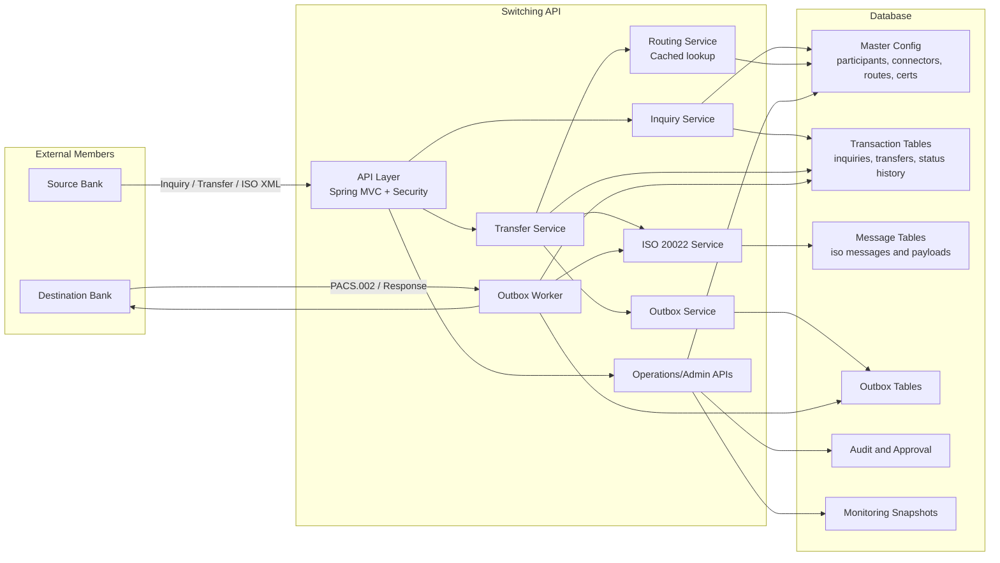
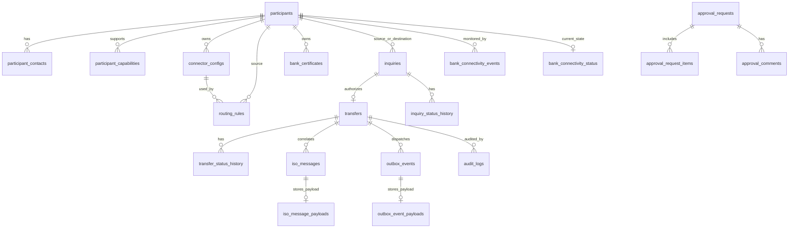
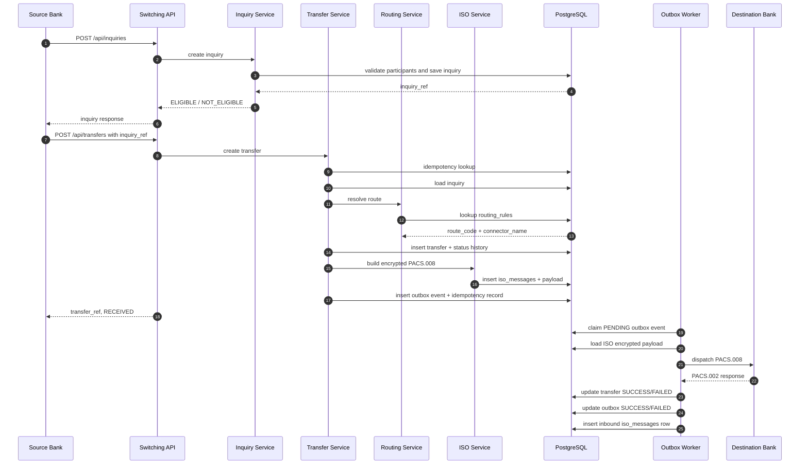
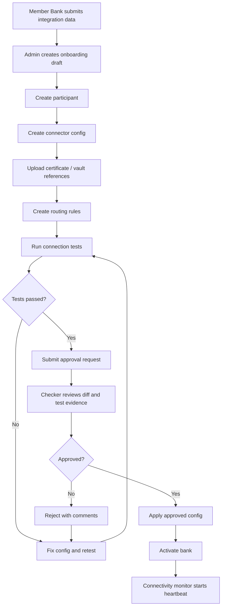

# Switching API - Database and Architecture Design

Last updated: 2026-05-15

This document is an English architecture and database design reference for the
Switching API project. It was written after scanning the current Spring Boot
codebase, Flyway migrations, JPA entities, repositories, and operations services.

PostgreSQL is now the active target database. For the implemented hot database,
warm archive, and cold-storage concept, see
[`postgres-switching-database-concept.md`](postgres-switching-database-concept.md).

The goal is to define the best production-oriented database structure for:

- Fast transfer creation.
- Fast routing resolution.
- Reliable transactional outbox dispatch.
- Safe bank onboarding and connection configuration.
- Clear monitorability for connected/disconnected member banks.
- Strong auditability and approval control for production changes.

This is a target design. Some tables already exist in the current project, while
some tables are recommended additions for production readiness.

---

## 1. Project Scan Summary

The current backend is a Java Spring Boot payment switching system with these
main modules:

| Module | Responsibility | Current DB Area |
|---|---|---|
| participant | Member bank master data | `participants`, legacy `participant_banks` |
| connector | Bank connection configuration | `connector_configs` |
| routing | Route lookup by source/destination/message type | `routing_rules` |
| inquiry | JSON inquiry flow | `inquiries`, `inquiry_status_history` |
| transfer | Core transfer lifecycle | `transfers`, `transfer_status_history` |
| iso | ISO 20022 messages and payloads | `iso_messages`, `iso_inquiries` |
| outbox | Transactional outbox dispatch | `outbox_events` |
| idempotency | Duplicate request protection | `idempotency_records` |
| audit | Immutable event audit | `audit_logs` |
| security | API key authentication | `api_keys` |
| operations | Admin/ops monitoring APIs | Read models over core tables |

Important current patterns:

- Transfer creation is synchronous until transfer, ISO message, idempotency, and
  outbox rows are committed.
- Bank dispatch is asynchronous via transactional outbox.
- Route lookup depends on `(source_bank, destination_bank, message_type, enabled, priority)`.
- Outbox workers claim rows by status and recover stuck `PROCESSING` rows.
- API keys are hashed after migration V17.
- Existing schema has both old `participant_banks` and newer `participants`.
  Production should standardize on `participants` as the canonical member bank table.

---

## 2. Recommended High-Level Architecture



### Architecture Principles

1. Keep the transfer write path short and deterministic.
2. Keep heavy payloads outside hot list/search rows.
3. Treat all production configuration changes as versioned and approved.
4. Make routing and connector lookup fast with narrow indexes.
5. Make monitoring read-heavy and cheap through current-state snapshot tables.
6. Keep audit append-only.
7. Keep secrets outside the main database; store only secret references.

---

## 3. Recommended Database Domains

The production schema should be grouped into six domains:

| Domain | Purpose | Tables |
|---|---|---|
| Master data | Member banks and capabilities | `participants`, `participant_contacts`, `participant_capabilities`, `participant_status_history` |
| Connection config | Connector settings, certificates, routing | `connector_configs`, `bank_certificates`, `routing_rules` |
| Change control | Maker-checker workflow | `approval_requests`, `approval_request_items`, `approval_comments` |
| Payment transactions | Inquiry and transfer lifecycle | `inquiries`, `inquiry_status_history`, `transfers`, `transfer_status_history` |
| Messaging and dispatch | ISO payloads, outbox, idempotency | `iso_messages`, `iso_message_payloads`, `outbox_events`, `outbox_event_payloads`, `idempotency_records` |
| Observability | Audit, connectivity, health checks | `audit_logs`, `bank_connectivity_status`, `bank_connectivity_events`, `connector_health_checks` |

---

## 4. Target Entity Relationship Overview



---

## 5. Recommended Core Tables

### 5.1 `participants`

Canonical member bank table. This should replace legacy `participant_banks`.

Recommended columns:

| Column | Type | Notes |
|---|---|---|
| `id` | BIGINT PK | Internal surrogate key |
| `bank_code` | VARCHAR(32) UNIQUE NOT NULL | Stable external bank code, uppercase |
| `bank_name` | VARCHAR(255) NOT NULL | Display name |
| `participant_type` | VARCHAR(32) NOT NULL | `DIRECT`, `INDIRECT`, `BANK`, `SWITCHING` |
| `status` | VARCHAR(32) NOT NULL | `DRAFT`, `CONFIGURED`, `PENDING_TEST`, `UAT_PASSED`, `PENDING_APPROVAL`, `ACTIVE`, `SUSPENDED`, `INACTIVE` |
| `country` | VARCHAR(8) NOT NULL | ISO country code |
| `currency` | VARCHAR(8) NOT NULL | Default settlement currency |
| `onboarding_status` | VARCHAR(32) NULL | Optional if separated from runtime `status` |
| `settlement_account_ref` | VARCHAR(128) NULL | Reference only, not sensitive account details |
| `created_by` | VARCHAR(128) NULL | Maker/admin |
| `approved_by` | VARCHAR(128) NULL | Checker |
| `activated_at` | DATETIME(3) NULL | Production activation time |
| `created_at` | DATETIME(3) NOT NULL | Creation timestamp |
| `updated_at` | DATETIME(3) NULL | Last update timestamp |

Recommended indexes:

```sql
UNIQUE KEY uk_participants_bank_code (bank_code);
KEY idx_participants_status (status);
KEY idx_participants_country_currency (country, currency);
```

Notes:

- `bank_code` should always be normalized to uppercase before insert/update.
- Do not use `upper(bank_code)` in queries; normalize input instead.
- Avoid deleting participants. Use status transitions.

### 5.2 `participant_contacts`

Operational and technical contacts for a member bank.

Recommended columns:

| Column | Type | Notes |
|---|---|---|
| `id` | BIGINT PK | |
| `bank_code` | VARCHAR(32) NOT NULL | FK-like reference to participants |
| `contact_type` | VARCHAR(32) NOT NULL | `OPS`, `TECH`, `SECURITY`, `BUSINESS` |
| `name` | VARCHAR(255) NOT NULL | |
| `email` | VARCHAR(255) NOT NULL | |
| `phone` | VARCHAR(64) NULL | |
| `enabled` | BOOLEAN NOT NULL | |
| `created_at` | DATETIME(3) NOT NULL | |
| `updated_at` | DATETIME(3) NULL | |

Recommended indexes:

```sql
KEY idx_participant_contacts_bank_type (bank_code, contact_type, enabled);
```

### 5.3 `participant_capabilities`

Tracks which message types and features each bank supports.

Recommended columns:

| Column | Type | Notes |
|---|---|---|
| `id` | BIGINT PK | |
| `bank_code` | VARCHAR(32) NOT NULL | |
| `message_type` | VARCHAR(32) NOT NULL | `PACS_008`, `PACS_002`, `PACS_028`, `PACS_004`, `ACMT_023`, `ACMT_024` |
| `direction` | VARCHAR(16) NOT NULL | `INBOUND`, `OUTBOUND`, `BOTH` |
| `enabled` | BOOLEAN NOT NULL | |
| `created_at` | DATETIME(3) NOT NULL | |
| `updated_at` | DATETIME(3) NULL | |

Recommended indexes:

```sql
UNIQUE KEY uk_capability_bank_msg_dir (bank_code, message_type, direction);
KEY idx_capability_msg_enabled (message_type, enabled);
```

---

## 6. Connection and Routing Tables

### 6.1 `connector_configs`

Connection configuration for each member bank.

Current table exists. Recommended production additions are marked below.

| Column | Type | Notes |
|---|---|---|
| `id` | BIGINT PK | |
| `connector_name` | VARCHAR(128) UNIQUE NOT NULL | Stable connector identifier |
| `bank_code` | VARCHAR(32) NOT NULL | Destination bank represented by connector |
| `connector_type` | VARCHAR(32) NOT NULL | `MOCK`, `HTTP`, `MQ`, `SFTP` |
| `endpoint_url` | VARCHAR(512) NULL | HTTP/MQ/SFTP target URL |
| `health_check_url` | VARCHAR(512) NULL | Recommended addition |
| `auth_type` | VARCHAR(32) NULL | `NONE`, `API_KEY`, `MTLS`, `OAUTH2`, `BASIC` |
| `secret_ref` | VARCHAR(255) NULL | Reference to vault secret, never plaintext |
| `certificate_ref` | VARCHAR(255) NULL | Reference to certificate table/vault |
| `timeout_ms` | INT NOT NULL | |
| `retry_count` | INT NOT NULL DEFAULT 3 | Recommended addition |
| `retry_backoff_ms` | INT NOT NULL DEFAULT 500 | Recommended addition |
| `enabled` | BOOLEAN NOT NULL | |
| `force_reject` | BOOLEAN NOT NULL | Testing only |
| `reject_reason_code` | VARCHAR(32) NULL | |
| `reject_reason_message` | VARCHAR(512) NULL | |
| `config_version` | INT NOT NULL DEFAULT 1 | Recommended addition |
| `approval_status` | VARCHAR(32) NULL | `DRAFT`, `PENDING_APPROVAL`, `APPROVED`, `REJECTED` |
| `created_at` | DATETIME(3) NOT NULL | |
| `updated_at` | DATETIME(3) NULL | |

Recommended indexes:

```sql
UNIQUE KEY uk_connector_configs_connector_name (connector_name);
KEY idx_connector_configs_bank_enabled (bank_code, enabled);
KEY idx_connector_configs_enabled_type (enabled, connector_type);
```

### 6.2 `routing_rules`

Fast route lookup table.

Current table exists and is good for route resolution. Production should add
effective dates and approval status.

| Column | Type | Notes |
|---|---|---|
| `id` | BIGINT PK | |
| `route_code` | VARCHAR(128) UNIQUE NOT NULL | Stable route id |
| `source_bank` | VARCHAR(32) NOT NULL | |
| `destination_bank` | VARCHAR(32) NOT NULL | |
| `message_type` | VARCHAR(32) NOT NULL | |
| `connector_name` | VARCHAR(128) NOT NULL | |
| `priority` | INT NOT NULL | Lowest number wins |
| `enabled` | BOOLEAN NOT NULL | |
| `fallback` | BOOLEAN NOT NULL DEFAULT FALSE | Recommended addition |
| `effective_from` | DATETIME(3) NULL | Recommended addition |
| `effective_until` | DATETIME(3) NULL | Recommended addition |
| `approval_status` | VARCHAR(32) NULL | Recommended addition |
| `created_at` | DATETIME(3) NOT NULL | |
| `updated_at` | DATETIME(3) NULL | |

Recommended indexes:

```sql
UNIQUE KEY uk_routing_rules_route_code (route_code);
KEY idx_routing_lookup_fast (
    source_bank,
    destination_bank,
    message_type,
    enabled,
    priority
);
KEY idx_routing_connector_enabled (connector_name, enabled);
KEY idx_routing_source_enabled (source_bank, enabled);
KEY idx_routing_destination_enabled (destination_bank, enabled);
```

Route lookup query should be:

```sql
SELECT *
FROM routing_rules
WHERE source_bank = ?
  AND destination_bank = ?
  AND message_type = ?
  AND enabled = TRUE
  AND (effective_from IS NULL OR effective_from <= NOW(3))
  AND (effective_until IS NULL OR effective_until > NOW(3))
ORDER BY priority ASC, id ASC
LIMIT 1;
```

This query is hot. Keep it narrow and cache the result in application memory with
cache invalidation after route changes.

### 6.3 `bank_certificates`

Do not store private keys in this application database. Store public certificates
and metadata, or references to a vault/HSM.

Recommended columns:

| Column | Type | Notes |
|---|---|---|
| `id` | BIGINT PK | |
| `bank_code` | VARCHAR(32) NOT NULL | |
| `certificate_type` | VARCHAR(32) NOT NULL | `MTLS`, `SIGNING`, `ENCRYPTION` |
| `environment` | VARCHAR(16) NOT NULL | `DEV`, `UAT`, `PROD` |
| `serial_number` | VARCHAR(128) NOT NULL | |
| `fingerprint_sha256` | VARCHAR(128) NOT NULL | |
| `public_certificate_pem` | TEXT NULL | Only if policy allows DB storage |
| `vault_ref` | VARCHAR(255) NULL | Preferred for production |
| `valid_from` | DATETIME(3) NOT NULL | |
| `valid_until` | DATETIME(3) NOT NULL | |
| `status` | VARCHAR(32) NOT NULL | `VALID`, `EXPIRING_SOON`, `EXPIRED`, `REVOKED` |
| `created_by` | VARCHAR(128) NULL | |
| `approved_by` | VARCHAR(128) NULL | |
| `created_at` | DATETIME(3) NOT NULL | |
| `updated_at` | DATETIME(3) NULL | |

Recommended indexes:

```sql
KEY idx_cert_bank_env_type (bank_code, environment, certificate_type, status);
KEY idx_cert_expiry (valid_until, status);
UNIQUE KEY uk_cert_fingerprint (fingerprint_sha256);
```

---

## 7. Maker-Checker Change Control

Production admin changes should not directly update active config. Use a
maker-checker workflow.

### 7.1 `approval_requests`

| Column | Type | Notes |
|---|---|---|
| `id` | BIGINT PK | |
| `request_ref` | VARCHAR(80) UNIQUE NOT NULL | Example `APR-20260515-...` |
| `change_type` | VARCHAR(64) NOT NULL | `NEW_BANK`, `CONNECTOR_UPDATE`, `ROUTE_UPDATE`, `CERT_UPLOAD`, `BANK_ACTIVATION` |
| `target_type` | VARCHAR(64) NOT NULL | `PARTICIPANT`, `CONNECTOR`, `ROUTE`, `CERTIFICATE` |
| `target_ref` | VARCHAR(128) NOT NULL | bank code, connector name, route code |
| `risk_level` | VARCHAR(16) NOT NULL | `LOW`, `MEDIUM`, `HIGH`, `CRITICAL` |
| `status` | VARCHAR(32) NOT NULL | `DRAFT`, `PENDING_APPROVAL`, `APPROVED`, `REJECTED`, `APPLIED`, `CANCELLED` |
| `maker` | VARCHAR(128) NOT NULL | |
| `checker` | VARCHAR(128) NULL | |
| `submitted_at` | DATETIME(3) NULL | |
| `approved_at` | DATETIME(3) NULL | |
| `rejected_at` | DATETIME(3) NULL | |
| `created_at` | DATETIME(3) NOT NULL | |
| `updated_at` | DATETIME(3) NULL | |

Recommended indexes:

```sql
UNIQUE KEY uk_approval_request_ref (request_ref);
KEY idx_approval_status_created (status, created_at);
KEY idx_approval_target (target_type, target_ref, status);
```

### 7.2 `approval_request_items`

Stores before/after config diffs as JSON.

| Column | Type | Notes |
|---|---|---|
| `id` | BIGINT PK | |
| `request_ref` | VARCHAR(80) NOT NULL | |
| `entity_type` | VARCHAR(64) NOT NULL | |
| `entity_ref` | VARCHAR(128) NOT NULL | |
| `operation` | VARCHAR(16) NOT NULL | `CREATE`, `UPDATE`, `DELETE`, `ACTIVATE`, `SUSPEND` |
| `before_json` | JSON NULL | MySQL JSON |
| `after_json` | JSON NOT NULL | |
| `created_at` | DATETIME(3) NOT NULL | |

Recommended indexes:

```sql
KEY idx_approval_items_request (request_ref);
KEY idx_approval_items_entity (entity_type, entity_ref);
```

### 7.3 `approval_comments`

| Column | Type | Notes |
|---|---|---|
| `id` | BIGINT PK | |
| `request_ref` | VARCHAR(80) NOT NULL | |
| `actor` | VARCHAR(128) NOT NULL | |
| `comment_text` | TEXT NOT NULL | |
| `created_at` | DATETIME(3) NOT NULL | |

---

## 8. Transaction Tables

### 8.1 `inquiries`

Current table exists. Keep it as the JSON inquiry lifecycle table.

Recommended additions:

- `expires_at DATETIME(3)` for inquiry TTL.
- `used_by_transfer_ref VARCHAR(80)` to mark one-time use explicitly.
- `client_inquiry_id` should be unique per channel if banks provide it.

Recommended indexes:

```sql
UNIQUE KEY uk_inquiries_inquiry_ref (inquiry_ref);
KEY idx_inquiries_status_created (status, created_at DESC);
KEY idx_inquiries_source_destination_created (source_bank, destination_bank, created_at DESC);
KEY idx_inquiries_destination_created (destination_bank, created_at DESC);
KEY idx_inquiries_used_by_transfer (used_by_transfer_ref);
KEY idx_inquiries_expires (expires_at, status);
```

### 8.2 `transfers`

Core hot transaction table.

Current table exists. Recommended production rules:

- Keep transfer row narrow.
- Do not store large ISO payloads here.
- Keep normalized uppercase bank codes.
- Keep `transfer_ref` as the external immutable id.
- Keep `id` as clustered primary key for fast inserts.

Recommended columns:

| Column | Type | Notes |
|---|---|---|
| `id` | BIGINT PK | Auto increment |
| `transfer_ref` | VARCHAR(80) UNIQUE NOT NULL | External reference |
| `client_transfer_id` | VARCHAR(128) NOT NULL | Client id or generated fallback |
| `idempotency_key` | VARCHAR(128) NOT NULL | |
| `inquiry_ref` | VARCHAR(80) UNIQUE NULL | One inquiry can create one transfer |
| `source_bank_code` | VARCHAR(32) NOT NULL | |
| `source_account_no` | VARCHAR(64) NOT NULL | Consider encrypted/masked storage |
| `destination_bank_code` | VARCHAR(32) NOT NULL | |
| `destination_account_no` | VARCHAR(64) NOT NULL | Consider encrypted/masked storage |
| `destination_account_name` | VARCHAR(255) NULL | |
| `amount` | DECIMAL(19,2) NOT NULL | DECIMAL(38,2) is safe but larger |
| `currency` | VARCHAR(8) NOT NULL | |
| `channel_id` | VARCHAR(64) NOT NULL | API, ISO, BANK channel |
| `route_code` | VARCHAR(128) NULL | Resolved route snapshot |
| `connector_name` | VARCHAR(128) NULL | Resolved connector snapshot |
| `external_reference` | VARCHAR(128) NULL | Bank response ref |
| `status` | VARCHAR(32) NOT NULL | `RECEIVED`, `SUCCESS`, `FAILED` |
| `error_code` | VARCHAR(64) NULL | |
| `error_message` | TEXT NULL | |
| `reference` | VARCHAR(255) NULL | User memo |
| `created_at` | DATETIME(3) NOT NULL | |
| `updated_at` | DATETIME(3) NOT NULL | |

Recommended indexes:

```sql
UNIQUE KEY uk_transfers_transfer_ref (transfer_ref);
UNIQUE KEY uk_transfers_channel_client_transfer (channel_id, client_transfer_id);
UNIQUE KEY uk_transfers_inquiry_ref (inquiry_ref);
KEY idx_transfers_status_created (status, created_at DESC, id DESC);
KEY idx_transfers_source_created (source_bank_code, created_at DESC);
KEY idx_transfers_destination_created (destination_bank_code, created_at DESC);
KEY idx_transfers_route_created (route_code, created_at DESC);
KEY idx_transfers_connector_created (connector_name, created_at DESC);
KEY idx_transfers_external_reference (external_reference);
```

### 8.3 `transfer_status_history`

Append-only status history.

Recommended indexes:

```sql
KEY idx_transfer_history_ref_created (transfer_ref, created_at, id);
KEY idx_transfer_history_status_created (status, created_at DESC);
```

### 8.4 `inquiry_status_history`

Append-only inquiry status history.

Recommended indexes:

```sql
KEY idx_inquiry_history_ref_created (inquiry_ref, created_at, id);
```

---

## 9. ISO Message and Payload Tables

### 9.1 `iso_messages`

Current table stores payload columns directly. For production speed, split large
payloads into a separate table.

Recommended `iso_messages` columns:

| Column | Type | Notes |
|---|---|---|
| `id` | BIGINT PK | |
| `correlation_ref` | VARCHAR(100) NULL | |
| `inquiry_ref` | VARCHAR(100) NULL | |
| `transfer_ref` | VARCHAR(100) NULL | |
| `end_to_end_id` | VARCHAR(100) NULL | |
| `message_id` | VARCHAR(100) NOT NULL | |
| `message_type` | VARCHAR(50) NOT NULL | |
| `direction` | VARCHAR(20) NOT NULL | |
| `security_status` | VARCHAR(30) NOT NULL | |
| `validation_status` | VARCHAR(30) NOT NULL | |
| `payload_ref` | BIGINT NULL | FK-like reference to payload row |
| `error_code` | VARCHAR(50) NULL | |
| `error_message` | TEXT NULL | |
| `created_at` | DATETIME(3) NOT NULL | |

Recommended indexes:

```sql
UNIQUE KEY uk_iso_messages_message_id_direction (message_id, direction);
KEY idx_iso_transfer_created (transfer_ref, created_at, id);
KEY idx_iso_inquiry_created (inquiry_ref, created_at, id);
KEY idx_iso_correlation_created (correlation_ref, created_at, id);
KEY idx_iso_end_to_end_created (end_to_end_id, created_at, id);
KEY idx_iso_search (message_type, direction, created_at DESC);
```

### 9.2 `iso_message_payloads`

Recommended addition.

| Column | Type | Notes |
|---|---|---|
| `id` | BIGINT PK | |
| `iso_message_id` | BIGINT NOT NULL | |
| `plain_payload` | LONGTEXT NULL | Avoid storing plain payload in prod unless required |
| `encrypted_payload` | LONGTEXT NULL | |
| `payload_hash` | VARCHAR(128) NULL | SHA-256 for integrity |
| `compression` | VARCHAR(32) NULL | `NONE`, `GZIP` |
| `created_at` | DATETIME(3) NOT NULL | |

Recommended indexes:

```sql
UNIQUE KEY uk_iso_payload_message (iso_message_id);
KEY idx_iso_payload_hash (payload_hash);
```

---

## 10. Transactional Outbox Tables

### 10.1 `outbox_events`

Current table exists. For production speed, split payload away from the hot outbox
state row.

Recommended columns:

| Column | Type | Notes |
|---|---|---|
| `id` | BIGINT PK | |
| `transfer_ref` | VARCHAR(80) NOT NULL | |
| `message_type` | VARCHAR(100) NOT NULL | |
| `payload_ref` | BIGINT NULL | Recommended if payload is split |
| `status` | VARCHAR(20) NOT NULL | `PENDING`, `PROCESSING`, `SUCCESS`, `FAILED`, `REVIEWED` |
| `retry_count` | INT NOT NULL | |
| `max_retry` | INT NOT NULL DEFAULT 3 | Recommended addition |
| `last_error` | TEXT NULL | |
| `locked_by` | VARCHAR(128) NULL | Recommended addition |
| `locked_at` | DATETIME(3) NULL | Recommended addition |
| `processed_at` | DATETIME(3) NULL | |
| `next_retry_at` | DATETIME(3) NULL | |
| `created_at` | DATETIME(3) NOT NULL | |
| `updated_at` | DATETIME(3) NOT NULL | |

Recommended indexes:

```sql
KEY idx_outbox_pending_fast (status, next_retry_at, id);
KEY idx_outbox_processing_recovery (status, updated_at, id);
KEY idx_outbox_transfer_created (transfer_ref, created_at, id);
KEY idx_outbox_processed (processed_at);
```

Fast claim pattern:

```sql
UPDATE outbox_events
SET status = 'PROCESSING',
    locked_by = ?,
    locked_at = NOW(3),
    updated_at = NOW(3)
WHERE id = ?
  AND status = 'PENDING';
```

### 10.2 `outbox_event_payloads`

Recommended addition.

| Column | Type | Notes |
|---|---|---|
| `id` | BIGINT PK | |
| `outbox_event_id` | BIGINT NOT NULL | |
| `payload` | LONGTEXT NOT NULL | |
| `payload_hash` | VARCHAR(128) NULL | |
| `created_at` | DATETIME(3) NOT NULL | |

Recommended indexes:

```sql
UNIQUE KEY uk_outbox_payload_event (outbox_event_id);
```

---

## 11. Idempotency and API Keys

### 11.1 `idempotency_records`

Current table exists. Recommended final shape:

| Column | Type | Notes |
|---|---|---|
| `id` | BIGINT PK | |
| `channel_id` | VARCHAR(64) NOT NULL | |
| `idempotency_key` | VARCHAR(128) NOT NULL | |
| `request_hash` | VARCHAR(128) NOT NULL | |
| `transfer_ref` | VARCHAR(80) NULL | |
| `status` | VARCHAR(32) NULL | |
| `created_at` | DATETIME(3) NOT NULL | |
| `updated_at` | DATETIME(3) NOT NULL | |
| `expired_at` | DATETIME(3) NULL | |

Recommended indexes:

```sql
UNIQUE KEY uk_idempotency_channel_key (channel_id, idempotency_key);
KEY idx_idempotency_transfer (transfer_ref);
KEY idx_idempotency_expired (expired_at);
```

### 11.2 `api_keys`

Current table exists and has been hardened to hash key values.

Recommended indexes:

```sql
UNIQUE KEY uk_api_key_hash (key_value);
KEY idx_api_keys_enabled (enabled);
KEY idx_api_keys_bank_enabled (bank_code, enabled);
KEY idx_api_keys_expiry (expires_at, enabled);
```

Rules:

- Never store plaintext API keys.
- Store only SHA-256 hash and display prefix.
- Keep admin/ops/bank role separation.
- Production demo keys must be disabled automatically.

---

## 12. Monitoring and Connectivity Tables

The current system derives health from connector config, routing rules, outbox,
and transfers. For a fast live monitor, add snapshot and event tables.

### 12.1 `bank_connectivity_status`

Current state table, one row per bank and environment.

| Column | Type | Notes |
|---|---|---|
| `id` | BIGINT PK | |
| `bank_code` | VARCHAR(32) NOT NULL | |
| `environment` | VARCHAR(16) NOT NULL | `DEV`, `UAT`, `PROD` |
| `status` | VARCHAR(32) NOT NULL | `CONNECTED`, `DEGRADED`, `DISCONNECTED`, `UNKNOWN` |
| `last_heartbeat_at` | DATETIME(3) NULL | |
| `last_success_at` | DATETIME(3) NULL | |
| `last_failure_at` | DATETIME(3) NULL | |
| `latency_ms` | INT NULL | Last measured latency |
| `success_rate_5m` | DECIMAL(5,2) NULL | |
| `success_rate_1h` | DECIMAL(5,2) NULL | |
| `active_routes_count` | INT NOT NULL DEFAULT 0 | |
| `failed_checks_count` | INT NOT NULL DEFAULT 0 | |
| `last_error_code` | VARCHAR(64) NULL | |
| `last_error_message` | TEXT NULL | |
| `updated_at` | DATETIME(3) NOT NULL | |

Recommended indexes:

```sql
UNIQUE KEY uk_connectivity_bank_env (bank_code, environment);
KEY idx_connectivity_status_updated (status, updated_at);
```

### 12.2 `bank_connectivity_events`

Append-only state changes and incidents.

| Column | Type | Notes |
|---|---|---|
| `id` | BIGINT PK | |
| `bank_code` | VARCHAR(32) NOT NULL | |
| `environment` | VARCHAR(16) NOT NULL | |
| `event_type` | VARCHAR(64) NOT NULL | `HEARTBEAT_OK`, `HEARTBEAT_FAILED`, `DISCONNECTED`, `RECOVERED` |
| `previous_status` | VARCHAR(32) NULL | |
| `new_status` | VARCHAR(32) NOT NULL | |
| `latency_ms` | INT NULL | |
| `error_code` | VARCHAR(64) NULL | |
| `error_message` | TEXT NULL | |
| `created_at` | DATETIME(3) NOT NULL | |

Recommended indexes:

```sql
KEY idx_connectivity_events_bank_created (bank_code, created_at DESC);
KEY idx_connectivity_events_type_created (event_type, created_at DESC);
```

### 12.3 `connector_health_checks`

Raw health check attempts.

| Column | Type | Notes |
|---|---|---|
| `id` | BIGINT PK | |
| `connector_name` | VARCHAR(128) NOT NULL | |
| `bank_code` | VARCHAR(32) NOT NULL | |
| `environment` | VARCHAR(16) NOT NULL | |
| `check_type` | VARCHAR(32) NOT NULL | `HEARTBEAT`, `INQUIRY`, `TRANSFER_TEST` |
| `status` | VARCHAR(32) NOT NULL | `SUCCESS`, `FAILED`, `TIMEOUT` |
| `latency_ms` | INT NULL | |
| `request_id` | VARCHAR(80) NULL | |
| `error_code` | VARCHAR(64) NULL | |
| `error_message` | TEXT NULL | |
| `created_at` | DATETIME(3) NOT NULL | |

Recommended indexes:

```sql
KEY idx_health_bank_created (bank_code, created_at DESC);
KEY idx_health_connector_created (connector_name, created_at DESC);
KEY idx_health_status_created (status, created_at DESC);
```

---

## 13. Audit Table

### 13.1 `audit_logs`

Current table exists. For production, add request/user context fields if possible.

Recommended columns:

| Column | Type | Notes |
|---|---|---|
| `id` | BIGINT PK | |
| `event_type` | VARCHAR(80) NOT NULL | |
| `reference_type` | VARCHAR(64) NULL | |
| `reference_id` | VARCHAR(128) NULL | |
| `actor` | VARCHAR(128) NULL | API key name, user, service |
| `actor_role` | VARCHAR(32) NULL | `ADMIN`, `OPS`, `BANK`, `SYSTEM` |
| `bank_code` | VARCHAR(32) NULL | |
| `request_id` | VARCHAR(80) NULL | |
| `ip_address` | VARCHAR(64) NULL | |
| `result` | VARCHAR(32) NULL | `SUCCESS`, `FAILED` |
| `payload` | JSON or LONGTEXT | Mask sensitive fields |
| `created_at` | DATETIME(3) NOT NULL | |

Recommended indexes:

```sql
KEY idx_audit_ref_created (reference_id, created_at);
KEY idx_audit_type_created (event_type, created_at DESC);
KEY idx_audit_actor_created (actor, created_at DESC);
KEY idx_audit_bank_created (bank_code, created_at DESC);
KEY idx_audit_request_id (request_id);
```

Audit logs should be append-only. Do not update or delete audit rows in normal
application flows.

---

## 14. Main Runtime Flow

### 14.1 Inquiry to Transfer to Outbox



### 14.2 Bank Onboarding and Activation Flow



---

## 15. Best Performance Strategy

### 15.1 Hot Path Rules

The hot path is:

```text
POST transfer -> validate inquiry -> resolve route -> insert transfer -> insert ISO metadata -> insert outbox -> commit
```

For fastest production behavior:

1. Keep route lookup cached.
2. Keep transfer insert row narrow.
3. Keep ISO and outbox payloads in separate payload tables.
4. Do not call external banks inside the database transaction.
5. Use append-only status history.
6. Use conditional update for outbox claiming.
7. Keep all bank codes normalized to uppercase before queries.

### 15.2 Partitioning

For high volume production, partition large append-only tables by month:

- `transfers`
- `transfer_status_history`
- `iso_messages`
- `iso_message_payloads`
- `outbox_events`
- `outbox_event_payloads`
- `audit_logs`
- `connector_health_checks`
- `bank_connectivity_events`

Use PostgreSQL declarative range partitioning for the large date-driven tables,
then run scheduled archive and retention jobs:

- Keep hot online data: 90 days.
- Keep audit and ISO payload archives according to regulatory retention.
- Keep outbox payloads only as long as operationally required.

### 15.3 Read Models for Operations

Do not make dashboards scan transaction tables repeatedly. Use snapshot tables:

- `bank_connectivity_status`
- optional `operations_daily_bank_metrics`
- optional `operations_hourly_transfer_metrics`

Suggested aggregate table:

```sql
CREATE TABLE operations_hourly_transfer_metrics (
    id BIGINT GENERATED ALWAYS AS IDENTITY PRIMARY KEY,
    bucket_start TIMESTAMP(3) NOT NULL,
    source_bank VARCHAR(32) NULL,
    destination_bank VARCHAR(32) NULL,
    status VARCHAR(32) NOT NULL,
    transfer_count BIGINT NOT NULL,
    total_amount NUMERIC(19,2) NULL,
    created_at TIMESTAMP(3) NOT NULL,
    CONSTRAINT uq_hourly_metric UNIQUE (bucket_start, source_bank, destination_bank, status)
);
```

### 15.4 Recommended Cache Strategy

| Data | Cache | Invalidated By |
|---|---|---|
| Routing resolution | In-memory cache | route create/update/disable |
| Participant active status | short TTL, 30-60 seconds | participant update |
| Connector config | short TTL, 30-60 seconds | connector update |
| API key lookup | short TTL, 30 seconds | key disable/rotate |

Do not cache transfer state for write flows.

---

## 16. Recommended Migration Direction

### Phase 1 - Clean Current Schema

1. Standardize member bank master data on `participants`.
2. Mark `participant_banks` as legacy.
3. Keep existing `routing_rules`, `connector_configs`, `transfers`, `inquiries`,
   `outbox_events`, `iso_messages`, `audit_logs`.
4. Fix duplicate/legacy indexes where names overlap.
5. Ensure `DECIMAL(19,2)` or consistent scale handling for amount comparison.

### Phase 2 - Add Production Admin Tables

Add:

- `participant_contacts`
- `participant_capabilities`
- `bank_certificates`
- `approval_requests`
- `approval_request_items`
- `approval_comments`

### Phase 3 - Add Monitoring Tables

Add:

- `bank_connectivity_status`
- `bank_connectivity_events`
- `connector_health_checks`
- optional hourly metrics tables

### Phase 4 - Split Heavy Payloads

Move payload columns to:

- `iso_message_payloads`
- `outbox_event_payloads`

Keep metadata in hot tables.

### Phase 5 - Partition and Archive

Add retention jobs and monthly partition/archive strategy for large append-only
tables.

---

## 17. Recommended API-to-DB Mapping

| API / Flow | Main Tables Written | Main Tables Read |
|---|---|---|
| `POST /api/inquiries` | `inquiries`, `inquiry_status_history`, `audit_logs` | `participants` |
| `POST /api/transfers` | `transfers`, `transfer_status_history`, `iso_messages`, `outbox_events`, `idempotency_records`, `audit_logs` | `inquiries`, `participants`, `routing_rules`, `connector_configs` |
| Outbox dispatch | `outbox_events`, `transfers`, `transfer_status_history`, `iso_messages`, `audit_logs` | `outbox_events`, `iso_messages`, `connector_configs` |
| Bank onboarding | `participants`, `connector_configs`, `routing_rules`, `approval_requests`, `audit_logs` | existing master data |
| Connectivity monitor | `bank_connectivity_status`, `bank_connectivity_events`, `connector_health_checks` | `participants`, `connector_configs`, `routing_rules` |
| Audit view | none | `audit_logs` |
| Trace view | none | `transfers`, `inquiries`, `iso_messages`, `outbox_events`, `audit_logs`, status history |

---

## 18. Production Safety Rules

1. Admin can create drafts, but production activation must require checker approval.
2. Member banks should not directly edit production switching config.
3. Member banks provide integration data; admins configure and checkers approve.
4. Secrets must live in a vault, not in database columns.
5. Certificate expiry must create alerts before 30 days.
6. Route disable/connector disable must be audited and approval-gated.
7. All payload logs must be masked.
8. Account numbers should be masked in audit and UI.
9. Production demo keys must be disabled.
10. Every transfer must be traceable by `transfer_ref`, `inquiry_ref`, `message_id`,
    and `request_id`.

---

## 19. Minimal Production-Ready Table List

If the team wants the fastest path to a solid production schema, implement this
minimum list first:

```text
participants
participant_contacts
participant_capabilities
connector_configs
bank_certificates
routing_rules
approval_requests
approval_request_items
inquiries
inquiry_status_history
transfers
transfer_status_history
iso_messages
iso_message_payloads
outbox_events
outbox_event_payloads
idempotency_records
api_keys
audit_logs
bank_connectivity_status
bank_connectivity_events
connector_health_checks
```

This gives the project:

- Fast transfer processing.
- Safe onboarding.
- Production-grade maker-checker.
- Live connectivity monitoring.
- Complete traceability.
- Cleaner payload storage.
- Better long-term performance.

---

## 20. Final Recommendation

The best structure for this project is:

```text
Canonical member bank config
  -> approved connector and routing config
  -> fast inquiry/transfer transaction tables
  -> transactional outbox for dispatch
  -> split payload storage for ISO/outbox bodies
  -> snapshot monitoring tables for live portal views
  -> append-only audit and maker-checker approval
```

This design keeps the payment write path fast while still supporting production
governance, operational monitoring, and member bank onboarding at scale.
